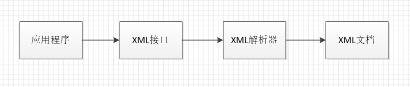
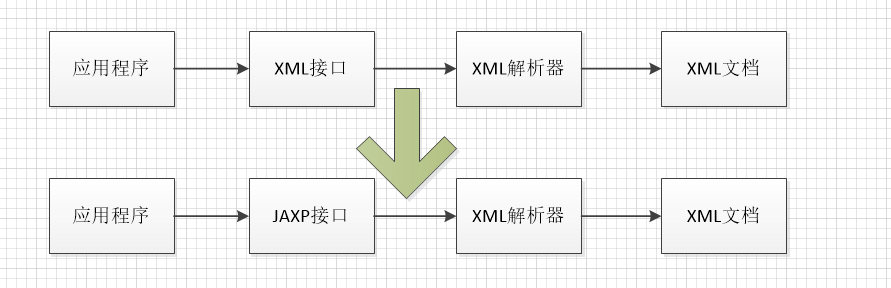

最近在整理Tomcat源码分析，在Catalina容器创建时候第一步就是采用Digester解析XML，所以就顺带复习了java的XML解析。
<p>

# 背景
## 1.1 DOM(Document Object Model)和SAX(Simple API for XML)


应用程序通过API调用实际的XML解析器来解析xml文档，常用的XML解析器，如Apache的Xerces

几乎所有的厂家都对两套标准的XML接口提供了支持，就是DOM和SAX，其中java中XML接口参见org.w3c.dom 和org.xml.sax。

所以应用程序如下：
```
org.xml.sax.XmlReader reader = new apache.xerces.parsers.SaxParser();
...
```
上面的通过sax解析代码会导致一个问题：
如果需要更换成dom解析，代码需要变更成new dom。。。，然后重新编译，发布。

由此产生了JAXP。

## 1.2 JAXP(Java API for XML Processing)


