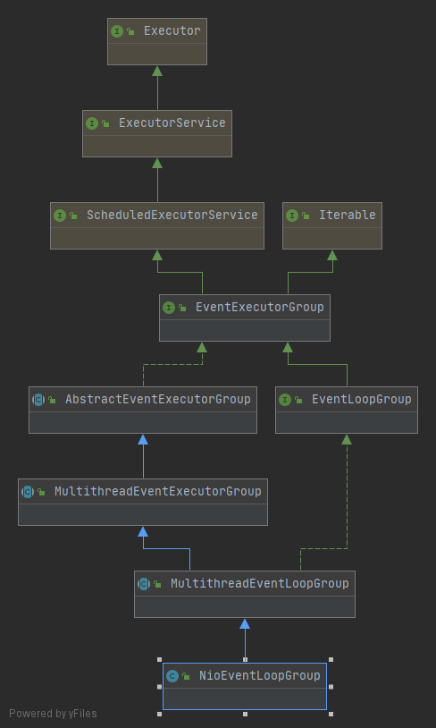

# 一. 基本样例

首先我们以一个常用的列子入手：

```java
//①
EventLoopGroup bossGroup = new NioEventLoopGroup(1);
EventLoopGroup workerGroup = new NioEventLoopGroup();
try {
    ServerBootstrap b = new ServerBootstrap();
    b.group(bossGroup, workerGroup)
        //②
        .channel(NioServerSocketChannel.class)
        .handler(new LoggingHandler(LogLevel.INFO))
        .childHandler(new ChannelInitializer<SocketChannel>() {
            @Override
            public void initChannel(SocketChannel ch) {
                ChannelPipeline p = ch.pipeline();
                if (sslCtx != null) {
                    p.addLast(sslCtx.newHandler(ch.alloc()));
                }
                p.addLast(new DiscardServerHandler());
            }
        });
    //③
    ChannelFuture f = b.bind(PORT).sync();
    f.channel().closeFuture().sync();
} finally {
    workerGroup.shutdownGracefully();
    bossGroup.shutdownGracefully();
}


```


# 二. NioEventLoopGroup

首先见名知意，`NioEventLoopGroup`是一个组(group)，组中的元素就是`NioEventLoop`,下图就是`NioEventLoopGroup`的整体结构图




上图不需要深究，只需要粗略的浏览下，可以得出以下信息：

​	`NioEventLoopGroup`，继承于`ExecutorService`和`ScheduleExecutorService`,所以具备了线程执行和调度执行的能力


`NioEventLoopGroup`类本身没有多少逻辑，主要就是提供了多个构造函数重载，最终还是调用了父类的构造函数。

在其父类`MultithreadEventLoopGroup`静态初始化块中，设定了默认线程数为处理器2倍的数目。

继续调用父类`MultithreadEventExecutorGroup`的构造函数，到这里终于看到实际的处理逻辑：

```java
protected MultithreadEventExecutorGroup(int nThreads, Executor executor,
                                        EventExecutorChooserFactory chooserFactory, Object... args) {

    if (executor == null) {
        executor = new ThreadPerTaskExecutor(newDefaultThreadFactory());
    }

    //children通过数组保存所有EventLoop元素,此处实际就是一个线程池
    children = new EventExecutor[nThreads];

    for (int i = 0; i < nThreads; i ++) {
        boolean success = false;
        try {
            //调用子类的创建元素方法
            children[i] = newChild(executor, args);
            success = true;
        } catch (Exception e) {
            throw new IllegalStateException("failed to create a child event loop", e);
        } finally {
            //如果其中一个元素创建失败，则将之前所有已创建的元素依次优雅关闭
            if (!success) {
                for (int j = 0; j < i; j ++) {
                    children[j].shutdownGracefully();
                }
				//因为优雅关闭是一个异步操作，需要逐个等待判断是否正常关闭
                for (int j = 0; j < i; j ++) {
                    EventExecutor e = children[j];
                    try {
                        while (!e.isTerminated()) {
                            e.awaitTermination(Integer.MAX_VALUE, TimeUnit.SECONDS);
                        }
                    } catch (InterruptedException interrupted) {
                        // Let the caller handle the interruption.
                        Thread.currentThread().interrupt();
                        break;
                    }
                }
            }
        }
    }
	
    //通过选取器工厂（此处与选择器selector区分开来），生成一个选取器
    //选取器只是group用来选择不同的EventLoop对象，和selector无关联。
    chooser = chooserFactory.newChooser(children);

    
    final FutureListener<Object> terminationListener = new FutureListener<Object>() {
        @Override
        public void operationComplete(Future<Object> future) throws Exception {
            if (terminatedChildren.incrementAndGet() == children.length) {
                terminationFuture.setSuccess(null);
            }
        }
    };
	//给所有的EventLoop对象添加线程终止的监听器
    for (EventExecutor e: children) {
        e.terminationFuture().addListener(terminationListener);
    }

    //将 eventLoop 放进一个不可变的 set集合中
    Set<EventExecutor> childrenSet = new LinkedHashSet<EventExecutor>(children.length);
    Collections.addAll(childrenSet, children);
    readonlyChildren = Collections.unmodifiableSet(childrenSet);
}
```


继续跟进`newChild`方法，该方法实现在`NioEventLoopGroup类中`

```java
protected EventLoop newChild(Executor executor, Object... args) throws Exception {
    EventLoopTaskQueueFactory queueFactory = args.length == 4 ? (EventLoopTaskQueueFactory) args[3] : null;
    return new NioEventLoop(this, executor, (SelectorProvider) args[0],
        ((SelectStrategyFactory) args[1]).newSelectStrategy(), (RejectedExecutionHandler) args[2], queueFactory);
}
```


# 二. NioEventLoop

`NioEventLoop`可以理解为一个线程，启动后就一直不停的处理各种任务。(Loop即无限循环)，包括io任务及普通线程任务。

类注释上注明了：该类实现了`SingleThreadEventLoop`，所以是一个单线程任务，用于将`channel`对象注册到`selector上`，并且进行多路分发。

`NioEventLoop`的构造函数中会执行`openSelector`方法，具体如下：

```java


```


因为继承了`ScheduledExecutorService`了，可以推断  `NioEventLoopGroup`具有线程调度的能力

`NioEventLoopGroup`从字面可以看出来是一个组对象，组里维护了一些元素，这些元素是`EventLoop`对象


首先从`ServerBootStrip`的`bind`作为入口

`bind`方法首先直接校验，然后调用`doBind`代码如下：

```java
private ChannelFuture doBind(final SocketAddress localAddress) {
    final ChannelFuture regFuture = initAndRegister();
    final Channel channel = regFuture.channel();
    if (regFuture.cause() != null) {
        return regFuture;
    }

    if (regFuture.isDone()) {
        // At this point we know that the registration was complete and successful.
        ChannelPromise promise = channel.newPromise();
        doBind0(regFuture, channel, localAddress, promise);
        return promise;
    } else {
        // Registration future is almost always fulfilled already, but just in case it's not.
        final PendingRegistrationPromise promise = new PendingRegistrationPromise(channel);
        regFuture.addListener(new ChannelFutureListener() {
            @Override
            public void operationComplete(ChannelFuture future) throws Exception {
                Throwable cause = future.cause();
                if (cause != null) {
                    // Registration on the EventLoop failed so fail the ChannelPromise directly to not cause an
                    // IllegalStateException once we try to access the EventLoop of the Channel.
                    promise.setFailure(cause);
                } else {
                    // Registration was successful, so set the correct executor to use.
                    // See https://github.com/netty/netty/issues/2586
                    promise.registered();

                    doBind0(regFuture, channel, localAddress, promise);
                }
            }
        });
        return promise;
    }
}
```

`initAndRegister`的执行逻辑如下：

```java
final ChannelFuture initAndRegister() {
    Channel channel = null;
    try {
        channel = channelFactory.newChannel();
        init(channel);
    } catch (Throwable t) {
        if (channel != null) {
            channel.unsafe().closeForcibly();
            return new DefaultChannelPromise(channel, GlobalEventExecutor.INSTANCE).setFailure(t);
        }

        return new DefaultChannelPromise(new FailedChannel(), GlobalEventExecutor.INSTANCE).setFailure(t);
    }

    ChannelFuture regFuture = config().group().register(channel);
    if (regFuture.cause() != null) {
        if (channel.isRegistered()) {
            channel.close();
        } else {
            channel.unsafe().closeForcibly();
        }
    }
    return regFuture;
}
```


我们重点关注下`init`方法

```java
@Override
void init(Channel channel) {
    //设置tcp相关参数
    setChannelOptions(channel, newOptionsArray(), logger);
    //设置相关业务参数
    setAttributes(channel, attrs0().entrySet().toArray(EMPTY_ATTRIBUTE_ARRAY));

    ChannelPipeline p = channel.pipeline();

    //将上述tcp和业务相关参数拷贝到临时变量
    final EventLoopGroup currentChildGroup = childGroup;
    final ChannelHandler currentChildHandler = childHandler;
    final Entry<ChannelOption<?>, Object>[] currentChildOptions;
    synchronized (childOptions) {
        currentChildOptions = childOptions.entrySet().toArray(EMPTY_OPTION_ARRAY);
    }
    final Entry<AttributeKey<?>, Object>[] currentChildAttrs = childAttrs.entrySet().toArray(EMPTY_ATTRIBUTE_ARRAY);

    //在channelpipeline中添加ChannelInitializer，将上述临时变量传递给该Initializer用于处理tcp连接接入
    p.addLast(new ChannelInitializer<Channel>() {
        @Override
        public void initChannel(final Channel ch) {
            final ChannelPipeline pipeline = ch.pipeline();
            ChannelHandler handler = config.handler();
            if (handler != null) {
                pipeline.addLast(handler);
            }

            ch.eventLoop().execute(new Runnable() {
                @Override
                public void run() {
                    pipeline.addLast(new ServerBootstrapAcceptor(
                            ch, currentChildGroup, currentChildHandler, currentChildOptions, currentChildAttrs));
                }
            });
        }
    });
}
```

在`initAndRegister`中可以看到如下调用

> ChannelFuture regFuture = config().group().register(channel);

注意此方法是调用`MultithreadEventLoopGroup`的`register`方法

```java
public ChannelFuture register(Channel channel) {
    return next().register(channel);
}
```

`next``实现是在其父类MultithreadEventExecutorGroup`中定义，即选择一个可用的`EventLoop`,`next`返回的类型是` ``SingleThreadEventLoop``:

```java
@Override
public EventExecutor next() {
    return chooser.next();
}
```

其中


所以最终的`register`实现是在` ``SingleThreadEventLoop``中

```java
@Override
public ChannelFuture register(final ChannelPromise promise) {
    ObjectUtil.checkNotNull(promise, "promise");
    promise.channel().unsafe().register(this, promise);
    return promise;
}
```

之后进入到`AbstractChannel.AbstractUnsafe`的`register`方法中


参考资料：

[自顶向下深入分析Netty](https://www.jianshu.com/nb/6812432)

[Netty源码分析系列之NioEventLoop的创建与启动](https://zhuanlan.zhihu.com/p/98680222)

[Netty 入门源码分析](https://www.cnblogs.com/rickiyang/p/12562408.html)

