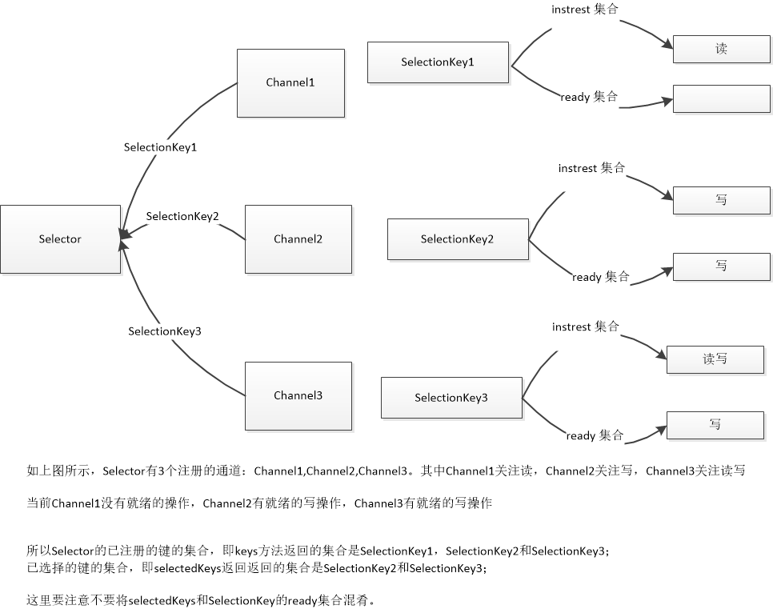

选择器提供了询问通道是否已经准备好执行每个I/0 操作的能力。

简单来说：一个`Selector`管理着N个`Channel`，`Selector`提供了相应的功能来通知调用方哪些`Channel`接入/数据。

> 传统的监控多个socket的Java解决方案是为每个socket创建一个线程并使得线
程可以在read( )调用中阻塞，直到数据可用,这事实上将每个被阻塞的线程当作了socket监控器，
并将Java 虚拟机的线程调度当作了通知机制。这两者本来都不是为了这种目的而设计的。程序员
和Java 虚拟机都为管理所有这些线程的复杂性和性能损耗付出了代价，这在线程数量的增长失控
时表现得更为突出。

真正的就绪选择必须由操作系统来做。操作系统的一项最重要的功能就是处理I/O 请求并通知
各个线程它们的数据已经准备好了。选择器类提供了这种抽象，使得Java 代码能够以可移植的方
式，请求底层的操作系统提供就绪选择服务。

# 一. 基础概念
## Selector
选择器管理着一个被注册的通道集合的信息和他们的就绪状态。


## SelectableChannel
`SelectableChannel`对象可以被注册到`Selector`上，同时可以告诉`Selector`哪些操作是感兴趣的。

一个通道可以被注册到多个选择器上，但对每个选择器而言智能被注册一次。

## SelectionKey
该对象封装了通道于特定的选择器的注册关系。

当`SelectableChanel.register()`调用时返回该对象。

该对象包含两个比特集：

    1.关心的通道操作 
    2.已准备好的操作
    
    
 调用可选择通道的`regiest`方法会将它注册到一个选择器上，
 1. 试图注册一个处于阻塞的通道，将会抛出`IllegalBlockingModeException`
 2. 通道一旦被注册，就不能回到阻塞状态
 
# 二. 选择器

## 2.1 创建选择器
```java
Selector selector = Selector.open( );
channel1.register (selector, SelectionKey.OP_READ);
channel2.register (selector, SelectionKey.OP_WRITE);
channel3.register (selector, SelectionKey.OP_READ | SelectionKey.OP_WRITE);
readyCount = selector.select (10000);
```

## 2.2 注册关系(SelectableChannel)
```java
//ops:关注的操作比特集
public abstract SelectionKey register (Selector sel, int ops) throws ClosedChannelException;
```

在任意给定的时间里，对于一个给定的选择器和一个给定的通道而言，只有一种注册关系是有效的

` isRegistered`用来检查一个通道是否被注册到任何一个选择器上。
这个方法没有提供关于通道被注册到哪个选择器上的信息，而只能知道它至少被注册到了一个选择器上


## 2.3 SelectionKey

表示一个特定的通道对象和一个特定的选择器对象之间的注册关系

可以调用`cancel`取消这种关系，`isValid`检查它是否仍然表示一种有效的关系。

* 注意重点：

**当键被取消时，它将被放在相关的选择器的已取消的键的集合里。注册不会立即被取消，但键会立即失效**

**当再次调用select( )方法时（或者一个正在进行的select()调用结束时），已取消
的键的集合中的被取消的键将被清理掉，并且相应的注销也将完成。通道会被注销，而新的
SelectionKey将被返回**


`SelectionKey`包含两个重要的集合：

* 1. instrest 集合
> 表示那些通道/选择器组合体所关心的操作

最初，这应该是通道被注册时传进来的值。这个interset 集合永远不会被选择器改变，但可以有两种方式改变

    1) 调用interestOps( )方法传入一个新的比特掩码参数来改变它
    2) 将通道重新注册到选择器
当相关的Selector上的select( )操作正在进行时改变键的interest集合，不会影响那个正在进行的选择操作

所有更改将会在select( )的下一个调用中体现出来

* 2. ready 集合
> 表示通道准备好要执行的操作，由此可知ready集合是interest集合的子集
> 确切的说，ready集合表示的是interest集合中从上次调用select( )以来已经就绪的那些操作

`readyOps`方法可以获取相关的通道的已经就绪的操作


需要注意的是，通过相关的选择键的`readyOps( )`方法返回的就绪状态指示只是一个提示，不是
保证。底层的通道在任何时候都会不断改变。其他线程可能在通道上执行操作并影响它的就绪状
态。同时，操作系统的特点也总是需要考虑的。


## 2.4 使用Selector

每一个Selector对象维护三个键的集合

1) 已注册的键的集合
```java
public abstract Set<SelectionKey> keys();
```
2) 已选择的键的集合
```java
public abstract Set<SelectionKey> selectedKeys();
```
3) 已取消的键的集合

包含了cancel( )方法被调用过的键（这个键已经被无效化），但它们还没有被注销。

这个集合是选择器对象的私有成员，因而无法直接访问。

下面是示意图：



### 2.4.1 select调用
下面介绍Selector最重要的操作函数：`select`,当`select`调用时，下面步骤将被执行：

1. 已取消的键的集合将会被检查。

如果它是非空的，每个已取消的键的集合中的键将从已注册和已选择集合中移除，并且相关的通道将被注销。

该步骤执行后，已取消的键的集合将是空的

2. 已注册的键的集合中的键的interest集合将被检查

该步骤执行后，对interest 集合的改动不会影响剩余的检查过程

该调用可能使得调用线程阻塞，通常会有一个超时值。

对于操作系统指示至少已经准备好的interest集合的通道，将执行以下两种操作：
1. 如果通道的键还没有处于已选择的键的集合中，那么键的ready集合将被清空，表示已准备好的比特集被设置

2. 否则，也就是键在已选择的键的集合中，键的集合将被表示操作系统发现的当前已准备好的操作的比特掩码更新。

3. 步骤2可能花费很长时间，步骤2结束，步骤1将重新执行，以完成任意一个在选择进行的过程中，键已经被取消的通道的注销


4. `select`返回的值是ready集合在步骤2中被修改的键的数量，而不是已选择的键的集合中的通道的数量。

**切记：
返回值不是已准备好的通道的总数，而是从上一个`select`调用之后进入就绪状态的通道的数量**

**即返回的数量是一个增量，而不是全量**


a) select
```java
public abstract int select() throws IOException;
```
最简单的无参数的`select`调用，正常情况下在没有通道就绪时将无限阻塞，直到返回一个非0的值，表示就绪的通道数量。

但是也可以返回非0的值，前提是`wakeup`被其他线程调用

b) select(timeout）
```java
public abstract int select(long timeout)    throws IOException;
```
这种调用与之前的例子完全相同，除了如果在您提供的超时时间（以毫秒计算）内没有通道就
绪时，它将返回0

注意：将`imeout`设置为0，效果等同于`select()`

b) selectNow
```java
public abstract int selectNow() throws IOException;
```
该方法是完全非阻塞的。如果没有通道就绪，则返回0

### 2.4.2 停止选择过程

有3种方式可以唤醒在`select`中休眠的线程

1) 调用`wakeup`


注意`wakeup`具有延迟性，且多次调用wakeup( )方法与调用它一次没有什么不同。

如何理解延迟性？

如果当前没有在进行中的选择，那么下一次对select( )方法的一种形式的调用将立即返回

2) 调用 `close`
3) 调用 `interrupt`


## 如何正确的使用选择器

选择是累积的。一旦一个选择器将一个`SelectionKey`添加到它的已选择的键的集合中，它就不会移除这个
键

并且，一旦`SelectionKey`处于已选择的键的集合中，它的ready 集合将只会被设置，而不会被清
理

正常的 步骤是：
1. 一个通道上的感兴趣的操作就绪
2. `SelectionKey`上的ready集合清空
3. 将已经就绪的操作添加到ready集合中
4. 将该`SelectionKey`加入到`Selector`已选择的键集合中

怎样手动清理一个`SelectionKey`上的ready集合？
将`SelectionKey`从`Selector`的已选择的键的集合中移除即可。
