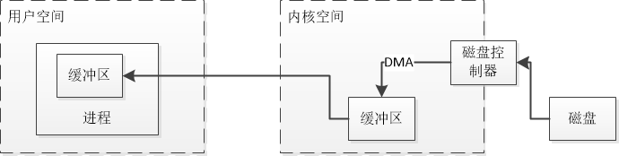
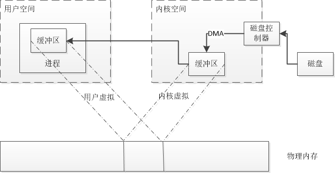

# 一. 简介
1. 相比CPU优化，IO性能 优化的投入比更为可观
2. JVM字节码的运行速率已接近本地执行，cpu已不再是束缚
3. JVM并非真的受IO束缚，操作系统兵分不能快速传递数据，而是JVM自身在IO方面效率欠佳
4. JVM是把双刃剑：隐藏操作系统的技术细节意味着某些个性鲜明、功能强大的特性被抛弃。

## 1. 基本概念
### 1.1 缓冲区：

用户空间的代码不能直接访问硬件设备
内核空间能与设备控制器通讯，控制着用户空间进程的状态

1. 用户进程使用系统调用，如 open，read后，将控制权交给内核空间
2. 内核随即向硬盘控制器发出命令读取磁盘数据，通过DMA，磁盘控制器把数据直接写入内核缓冲区，无需主CPU协助。
3. 内核缓冲区装满后，内核即把数据拷贝到用户缓冲区

*为什么不能直接让磁盘控制器将数据送到用户空间的缓冲区呢？*
1. 通常硬件不能直接访问用户空间
2. 磁盘这种基于块存储的硬件设备操作的是固定大小的数据块，而用户空间请求的可能是任意带线啊哦的或非对齐的数据，在数据往来用户空间和存储设备的过程中，内核负责数据的分解，再组合工作，充当着中间人的角色。

### 1.2 虚拟内存

特点：
1. 虚拟地址和物理内存地址是多对一的关系
2. 虚拟内存空间可大于实际可用的硬件内存

特点1可以让我们绕过`DMA不能直接存储到用户空间`的限制，

我们可以把内核空间地址与用户空间的虚拟地址映射到同一个物理地址，这样DMA就可以填充对内核和用户均可见的的缓冲区。

### 1.3 内存页面调度

现代CPU包含一个称之为内存管理单元(MMU)的子系统，逻辑上位于CPU和物理内存之间，包含着虚拟地址和物理内存的映射关系。

当CPU引用某内存地址的时候，MMU负责确定该地址所在页，并将虚拟页号转换为物理页号(由硬件完成，速度极快）

如果不存在该映射关系，MMU则会向CPU、提交一个页错误

页错误随机产生一个陷阱(类似于系统调用),把控制权交给内核，附带导致错误的虚拟地址信息，然后内核会将缺失的页内容读取回写到物理内存。