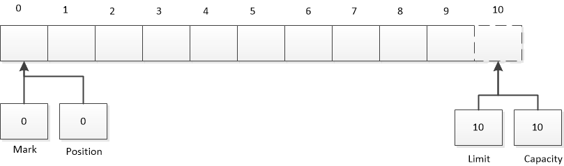
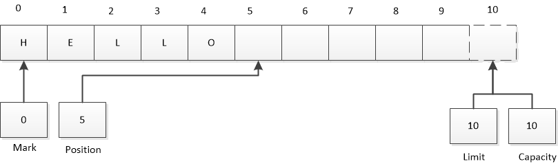
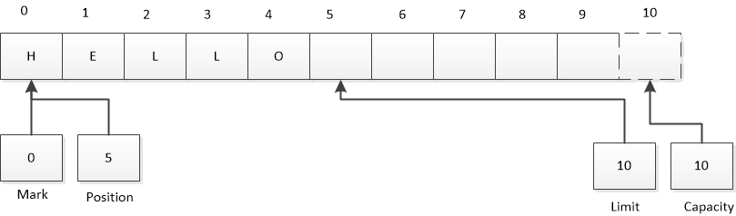
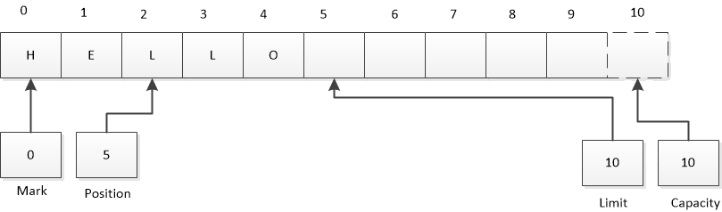
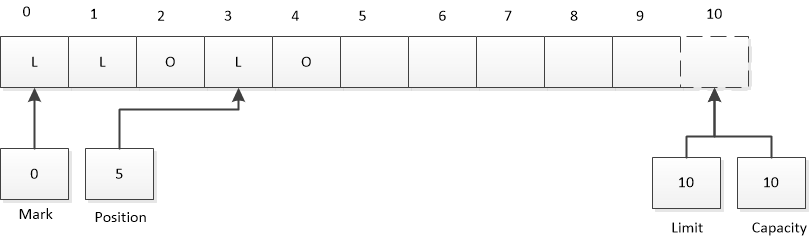

# 一. 属性
`Capacity`：缓冲区能够容纳的最大数量。创建时设定，永远不能改变

`Limit`：缓冲区第一个不能被读或写的元素。即现存元素的计数

`Position`:下一个要被读/写的元素的索引。由`get`和`put`更新

`Mark`:备忘位置，调用mark来设定mark=postion。调用`reset`设定position=mark

四者的关系：
> 0<=mark<=position<=limit<=capacity

新创建一个初始容量为10的ByteBuffer逻辑视图如下:



## put存储
```java
buffer.put((byte)'H').put((byte)'e').put((byte)'l').put((byte)'l').put((byte)'o');
```

假设我们想将缓冲区中的内容从
“Hello”的ASCII码更改为“Mellow”。我们可以这样实现
```java
buffer.put(0,(byte)'M').put((byte)'w');
```

**注意： buffer.put(0,(byte)'M')  不会改变`Position`的值**

## 翻转

当我们写入了一系列数据后，需要再次读取一部分数据时该如何操作呢？

我们需要指定读取的起始序号和结束序号，所以我们引入`Limit`属性作为读/写 的结束位置

如下所示:结束位置为当前序号所在位置，起始位置为0
```java
buffer.limit(buffer.position()).position(0);
```
NIO的API设计了对应的API，效果等同于上图
```java
Buffer.flip();
```
`Rewind `只更改`position`，不改变`limit`

翻转后的状态如下：


## 压缩

有时候我们需要释放一部分已处理的空间，以便继续写入。就需要用到`compact`功能

压缩前：


执行`compact`压缩后：



# 标记
使缓冲区能够记住某个位置并在之后将其返回。

`mark`:将position值赋给mark字段


`reset`:将mark值赋给position字段


## 比较

怎么比较两个缓冲区呢，充要条件是：

1. 对象类型相同
2. 剩余相同的元素(即`limit`-`position`需要相等)
3. 在每个缓冲区中应被Get()函数返回的剩余数据元素序列必须一致