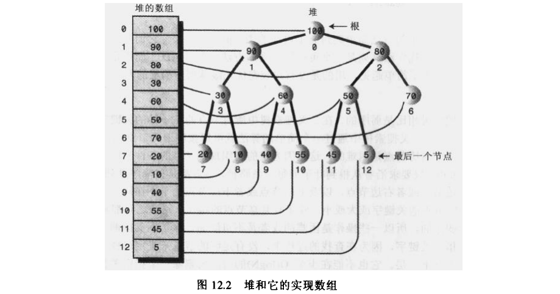
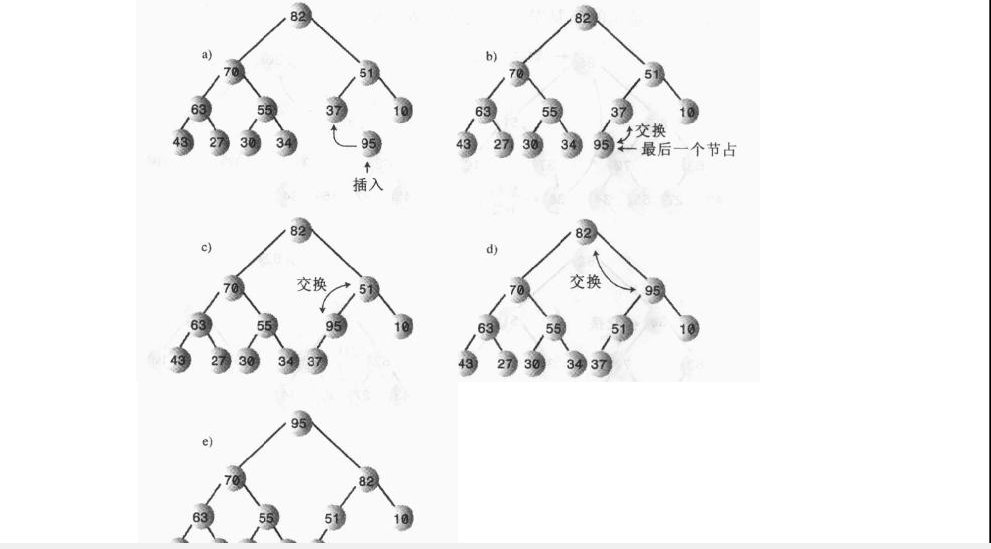

# 一. 堆的描述

首先给出堆的数组实现图，简单明了。
**注意：本篇给的堆都默认为最大堆，即根节点为最大值。**


ps:上面的数组实现，有如下特点(后续代码实现时会用到)：
```
选择任意节点为x,
则其父节点下标=(x-1)/2
左节点下标=2*x+1
右节点下标=2*x+2
```


堆的特点：

1. 堆是完全二叉树
2. 经常用数组来实现。
3. 堆中每一个节点都满足堆的条件，即每一个节点都大于子节点
4. 堆是弱序的，即从根到任一叶子节点的路径是降序的，但不像二叉树那样绝对有序：左节点小于右节点。所以不支持遍历

# 二. 堆的移除

移除是指删除最大的节点，即根节点(此处讨论的是最大堆)，步骤如下：

1. 移走根
2. 把最后一个节点移到根节点
3. 向下筛选这个节点，直到它在一个大于它的节点之下，小于它的节点之上为止。

具体如下图：**向下筛选时需要检查哪个子节点更大，和较大的子节点交互位置**


# 二. 堆的插入

1. 在最后一个节点插入新节点
2. 向上筛选：相较于向下筛选，向上比较简单，因为它只有一个父节点，只需要找到一个大于它的节点之下，小于它的节点之下



# 三. 堆的实现
```java

public class Heap {
    int currentSize;
    private Integer[] array = new Integer[0];

    public void insert(Integer value) {
        array[currentSize++] = value;
        shitUp(currentSize);
    }

    public int remove() {
        Integer root = array[0];
        Integer lastNode = array[currentSize];
        shitDown(currentSize);

        return root;
    }

    private void shitUp(int index) {
        //1.将该节点缓存到tmp，减少移动
        //2.比较上级节点和本节点大小，如果上级节点小于本节点，交换。
        Integer tmp = array[index];

        int parentIndex = (index - 1) / 2;
        while (array[parentIndex] < array[index]) {
            array[index] = array[parentIndex];
            index = parentIndex;
            parentIndex = (index - 1) / 2;
        }
        array[index] = tmp;
    }

    private void shitDown(int index) {
        Integer root = array[index];
        Integer largeIndex;

        while (index < currentSize / 2) {
            Integer leftIndex = 2 * index + 1;
            Integer rightIndex = 2 * index + 2;
            if (rightIndex < currentSize && array[leftIndex] < array[rightIndex]) {
                largeIndex = rightIndex;
            } else {
                largeIndex = leftIndex;
            }

            if (root >= array[largeIndex]) {
                break;
            }
            array[index] = array[largeIndex];
            index = largeIndex;
        }

        array[index] = root;
    }
}
```

# 四. java中的堆实现

跳过 前面的几章数据结构先写堆是有原因的，

因为在使用java线程池时看到不少教程在比较`Timer`和`ScheduledThreadPoolExecutor`，

所以就想了解下作为定时服务的初代实现是什么样的，跟踪`Timer`源码时发现，内部其也是使用的堆结构


首先看下`Timer`最常用的用法
```java
 public void schedule(TimerTask task, long delay) {
        if (delay < 0)
            throw new IllegalArgumentException("Negative delay.");
        sched(task, System.currentTimeMillis()+delay, 0);
    }


 private void sched(TimerTask task, long time, long period) {
        if (time < 0)
            throw new IllegalArgumentException("Illegal execution time.");

        // Constrain value of period sufficiently to prevent numeric
        // overflow while still being effectively infinitely large.
        if (Math.abs(period) > (Long.MAX_VALUE >> 1))
            period >>= 1;

        synchronized(queue) {
            if (!thread.newTasksMayBeScheduled)
                throw new IllegalStateException("Timer already cancelled.");

            synchronized(task.lock) {
                if (task.state != TimerTask.VIRGIN)
                    throw new IllegalStateException(
                        "Task already scheduled or cancelled");
                //task对象就是堆结构中的元素，nextEnxecutionTime(下次执行时间)则作为堆元素比较的关键字
                task.nextEnxecutionTime = time;
                task.period = period;
                task.state = TimerTask.SCHEDULED;
            }
            //queue则是Timer使用的堆结构
            queue.add(task);
            if (queue.getMin() == task)
                queue.notify();
        }
    }

```

下面就是完整的`TaskQueue`实现：

```java
/**
 * This class represents a timer task queue: a priority queue of TimerTasks,
 * ordered on nextExecutionTime.  Each Timer object has one of these, which it
 * shares with its TimerThread.  Internally this class uses a heap, which
 * offers log(n) performance for the add, removeMin and rescheduleMin
 * operations, and constant time performance for the getMin operation.
 */
class TaskQueue {
    /**
     * Priority queue represented as a balanced binary heap: the two children
     * of queue[n] are queue[2*n] and queue[2*n+1].  The priority queue is
     * ordered on the nextExecutionTime field: The TimerTask with the lowest
     * nextExecutionTime is in queue[1] (assuming the queue is nonempty).  For
     * each node n in the heap, and each descendant of n, d,
     * n.nextExecutionTime <= d.nextExecutionTime.
     */
    private TimerTask[] queue = new TimerTask[128];

    /**
     * The number of tasks in the priority queue.  (The tasks are stored in
     * queue[1] up to queue[size]).
     */
    private int size = 0;

    /**
     * Returns the number of tasks currently on the queue.
     */
    int size() {
        return size;
    }

    /**
     * Adds a new task to the priority queue.
     */
    void add(TimerTask task) {
        // Grow backing store if necessary
        if (size + 1 == queue.length)
            queue = Arrays.copyOf(queue, 2*queue.length);

        queue[++size] = task;
        fixUp(size);
    }

    /**
     * Return the "head task" of the priority queue.  (The head task is an
     * task with the lowest nextExecutionTime.)
     */
    TimerTask getMin() {
        return queue[1];
    }

    /**
     * Return the ith task in the priority queue, where i ranges from 1 (the
     * head task, which is returned by getMin) to the number of tasks on the
     * queue, inclusive.
     */
    TimerTask get(int i) {
        return queue[i];
    }

    /**
     * Remove the head task from the priority queue.
     */
    void removeMin() {
        queue[1] = queue[size];
        queue[size--] = null;  // Drop extra reference to prevent memory leak
        fixDown(1);
    }

    /**
     * Removes the ith element from queue without regard for maintaining
     * the heap invariant.  Recall that queue is one-based, so
     * 1 <= i <= size.
     */
    void quickRemove(int i) {
        assert i <= size;

        queue[i] = queue[size];
        queue[size--] = null;  // Drop extra ref to prevent memory leak
    }

    /**
     * Sets the nextExecutionTime associated with the head task to the
     * specified value, and adjusts priority queue accordingly.
     */
    void rescheduleMin(long newTime) {
        queue[1].nextExecutionTime = newTime;
        fixDown(1);
    }

    /**
     * Returns true if the priority queue contains no elements.
     */
    boolean isEmpty() {
        return size==0;
    }

    /**
     * Removes all elements from the priority queue.
     */
    void clear() {
        // Null out task references to prevent memory leak
        for (int i=1; i<=size; i++)
            queue[i] = null;

        size = 0;
    }

    /**
     * Establishes the heap invariant (described above) assuming the heap
     * satisfies the invariant except possibly for the leaf-node indexed by k
     * (which may have a nextExecutionTime less than its parent's).
     *
     * This method functions by "promoting" queue[k] up the hierarchy
     * (by swapping it with its parent) repeatedly until queue[k]'s
     * nextExecutionTime is greater than or equal to that of its parent.
     */
    private void fixUp(int k) {
        while (k > 1) {
            int j = k >> 1;
            if (queue[j].nextExecutionTime <= queue[k].nextExecutionTime)
                break;
            TimerTask tmp = queue[j];  queue[j] = queue[k]; queue[k] = tmp;
            k = j;
        }
    }

    /**
     * Establishes the heap invariant (described above) in the subtree
     * rooted at k, which is assumed to satisfy the heap invariant except
     * possibly for node k itself (which may have a nextExecutionTime greater
     * than its children's).
     *
     * This method functions by "demoting" queue[k] down the hierarchy
     * (by swapping it with its smaller child) repeatedly until queue[k]'s
     * nextExecutionTime is less than or equal to those of its children.
     */
    private void fixDown(int k) {
        int j;
        while ((j = k << 1) <= size && j > 0) {
            if (j < size &&
                queue[j].nextExecutionTime > queue[j+1].nextExecutionTime)
                j++; // j indexes smallest kid
            if (queue[k].nextExecutionTime <= queue[j].nextExecutionTime)
                break;
            TimerTask tmp = queue[j];  queue[j] = queue[k]; queue[k] = tmp;
            k = j;
        }
    }

    /**
     * Establishes the heap invariant (described above) in the entire tree,
     * assuming nothing about the order of the elements prior to the call.
     */
    void heapify() {
        for (int i = size/2; i >= 1; i--)
            fixDown(i);
    }
}
```


比较下和我们自己实现的堆差异有哪些?

**1. 该堆是最小堆，即根元素是最小值**

```
体现到代码层面，就是删除元素时，最后一个元素提到根元素的位置，需要下沉，

最大堆下层时需要找出左右节点中较大的值交换位置，
最小堆则需要找出左右节点中较小的值交换位置，
```

**2. 该堆存储的空间是1-size，即0位置没有存储值**

猜测这样设计的目的在于方便读取父，左，右节点，大部分都可以通过移位运算完成，速度更快

```
节点为n，
则父节点=n/2-->n>>1
左节点=2n-->n<<1
右节点=2n+1-->n<<1+1
```

好了，堆结构就分析到这里了，了解了其基本结构，其他相关类的分析也就水到渠成了。

可以自己分析下`PriorityQueue`，这个类是java 1.5之后和`J.U.C`一起推出的，主要用于`PriorityBlockingQueue`,`DelayQueue`等工具类中。