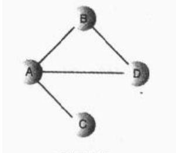
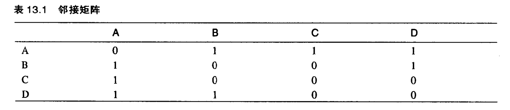
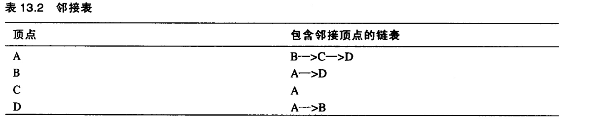

# 一. 图的基本概念

* 邻接：两个顶点被同一条边连接，就称这两个顶点是邻接的
* 路径：路径是边的序列。
* 连通：至少右一条路径可以连接所有的顶点，那么这个图被称作连通的。

有向图和带权图：

* 无向图：图中的边没有方向，可以从任意以便到另外一边。所以可以从`A`到`B`,也可以从`B`到`A`,两者是等价的。（无向图很好的模拟了高速公路网，因为公路可以按照两个方向行驶）

* 有向图：在某些图中，边被赋予一个权值，能代表两个顶点间的物理举例或者时间或者花费，这样的图叫做带权图。（如飞机航线）

本节我们主要讨论无向、无权图。

# 二. 如何在程序中表示图


顶点比较好实现
```java
public class Vertex {
    private int label;
    private  boolean isVisited;
}
```
边比较麻烦一点，考虑到图并不像树，拥有固定的结构，
为了模拟图这种自由形式的组织结构，需要用一种不同的方法表示边

主要有以下两种方式：
1. 邻接矩阵
2. 邻接表

## 2.1 邻接矩阵
邻接矩阵是一个二维数组，数据项表示两点间是否存在边。

如果有N个顶点，则邻接矩阵就是N*N的数组

示意图：<br>



观察上图，可以得出以下几点
* 两个顶点有边则标识为1，否则为0
* 顶点与自身连接表示为0
* 矩阵的上三角是下三角的镜像

上三角和下三角互为镜像，冗余低效，但在计算机中，创造一个三角形数组比较困难，只能接受这个冗余

## 2.2 邻接表

邻接表本质上是一个链表数组(或链表的链表)。

每个单独的链表表示了有哪些顶点和当前顶点邻接。

示意图如下：<br>



`->`表示链表中的一个节点，并不强求有序，与路径无关。


## 2.3 在图中添加顶点和边

首先我们用`vertexList`表示顶点数组，
1. 创建一个顶点
```java
vertexList[i++] = new  Vertex('A');
```

1. 添加边

添加边取决于是采用邻接矩阵还是邻接表表示。

如果使用邻接矩阵在顶点1和顶点3加一条边时，
```java
adjMat[1][3] = 1;
adjMat[3][1] = 1;
```
如果使用邻接表，则把1加入到3的链表中，然后把3加入到1的链表中。

完整实现：
```java

class Vertex {
    private int label;
    private boolean isVisited;

    public Vertex(char label) {
        this.label = label;
        this.isVisited = false;
    }
}

public class Graph {
    private  final  int maxNodes = 20;
    private  Vertex vertexList[];//顶点
    private  int adjMat[][];//邻接矩阵
    private  int nVerts;//当前顶点数目

    public Graph()
    {
        //初始化顶点数组
        vertexList = new Vertex[maxNodes];
        //初始化邻接矩阵
        adjMat = new int[maxNodes][maxNodes];
        for (int i = 0; i < maxNodes; i++) {
            for (int j = 0; j < maxNodes; j++) {
                adjMat[i][j] = 0;
            }
        }
    }

    /**
     * 添加顶点
     * @param label
     */
    public void addVertex(char label)
    {
        vertexList[nVerts++] = new Vertex(label);
    }

    /**
     * 添加边
     * @param start
     * @param end
     */
    public void addEdge(int start,int end)
    {
       adjMat[start][end] =1;
       adjMat[end][start] =1;
    }
}

```

# 三. 搜索