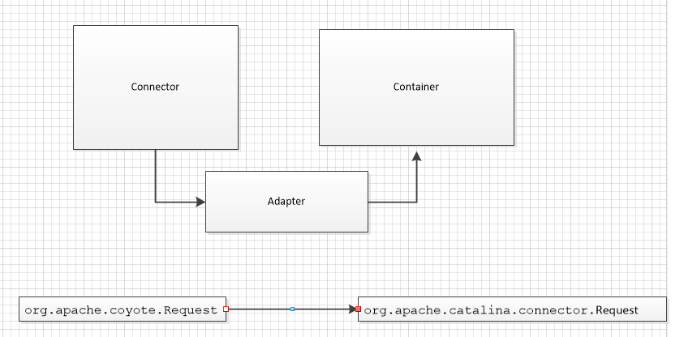

上篇讲到Http11Processor解析完Request请求后，会调用Adapter.service(request, response)。`<br>

Adapter顾名思义：适配器。适配不同的容器
之前我们讲到Service由Connector和多个Container容器组成，Connector和Container就是通过Adapter连接的。<br>

如果Tomcat需要更换容器，如采用ContainerNew，则只需要新建一个类实现Adapter接口，调用ContainerNew相应的方法，对Connector没有任何影响。


这里有两个类都叫Request，不能搞混肴。
* org.apache.coyote.Request。

  查看注释可以得知,Request是面向底层socket-高性能处理通讯类，大部分字段都是GC free的，即很少被垃圾回收。

  ps：如果让我写可能就是直接用String来组织报文头了，Tomcat为性能考虑，大部分属性都是字节数组，值得学习。
* org.apache.catalina.connector.Request
  因为Container容器本质上还是一个实现了Servlet技术的容器，所有Container容器只认识servlet相关的对象。
  所以该类继承了HttpServeletRequest，并且含有org.apache.coyote.Request属性，这样既满足了servlet容器需要，又满足了底层socket读取的需要。

好了，开始分析Adapter类：

# 主要作用
Adapter有以下主要功能：
* 根据传递过来的Tomcat内部的Request、Response对象 生成对应的Serverlet容器的Request和Response
* 调用对应的容器方法


Http11Processor的Adapter对象是在创建时由AbstractProtocol对象传递的;而且Processor对象大都数属性都来自于Protocol对象
``` java
protected Processor createProcessor() {
        Http11Processor processor = new Http11Processor(getMaxHttpHeaderSize(), getEndpoint(),
                getMaxTrailerSize(), allowedTrailerHeaders, getMaxExtensionSize(),
                getMaxSwallowSize(), httpUpgradeProtocols);
        processor.setAdapter(getAdapter());
        processor.setMaxKeepAliveRequests(getMaxKeepAliveRequests());
        processor.setConnectionUploadTimeout(getConnectionUploadTimeout());
        processor.setDisableUploadTimeout(getDisableUploadTimeout());
        processor.setCompressionMinSize(getCompressionMinSize());
        processor.setCompression(getCompression());
        processor.setNoCompressionUserAgents(getNoCompressionUserAgents());
        processor.setCompressableMimeTypes(getCompressableMimeTypes());
        processor.setRestrictedUserAgents(getRestrictedUserAgents());
        processor.setMaxSavePostSize(getMaxSavePostSize());
        processor.setServer(getServer());
        processor.setServerRemoveAppProvidedValues(getServerRemoveAppProvidedValues());
        return processor;
    }
```
AbstractProtocol的Adapter对象又是怎么生成的呢？是在Connector对象调用initInternal时主要new出来的。。。
``` java
adapter = new CoyoteAdapter(this);
protocolHandler.setAdapter(adapter);
```

好的，开始重点关注CoyoteAdapter对象
* 转换Req、Res
    主要是通过Connector对象的createRequest和createResponse生成需要的请求、响应对象。

* postParseRequest
   * 通过Connector的编码方式对uri/parameter等参数编码
   * 路由查询
    > connector.getService().getMapper().map(serverName, decodedURI,
                    version, request.getMappingData());
* 调用容器的Pipeline
    > connector.getService().getContainer().getPipeline().getFirst().invoke(request, response);