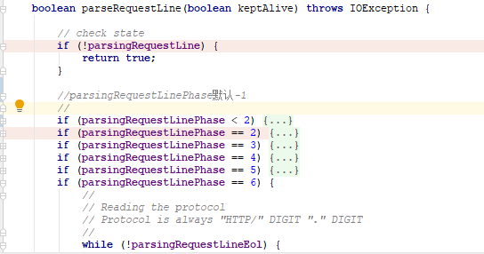

上一篇讲到Http11Processor的service方法<br>
service方法主要步骤如下
* 解析请求报文行
* 解析请求报文头
* 以上步骤如果产生非IO异常，则返回400错误
* 检查报文头中是否有upgrade，如果有，检查是否支持升级规约
* prepareRequest
  * 检查并设置http规约
  * 检查connection字段？
  * 如果http1.1，则检查是否有expect字段，如果是否符合Expect:100-continue，符合返回，不符合返回417错误
    * experct用户客户端post数据时，如果大于1024字节，需要征求服务器同意
  * 检查user-agent 字段
  * 检查完整的Uri
  * 检查transfer-encoding？？
  * 检查contentLength
  * 检查host
    * 如果规约是http1.1 但是不存在host，则返回400
    * 调用parseHost
  *
* 调用 `getAdapter().service(request, response);`
>
AbstractHttp11Procotol中createProcess方法中调用了
processor.setAdapter(getAdapter());

ps:最近阅读源码心得：关注整体脉络，不要限于细节，所以明天就不继续看HttpProcessor相关方法了，继续往下看Adapter的service方法。

``` java
public SocketState service(SocketWrapperBase<?> socketWrapper)
        throws IOException {
        RequestInfo rp = request.getRequestProcessor();
        rp.setStage(org.apache.coyote.Constants.STAGE_PARSE);

        // 初始化相关对象
        setSocketWrapper(socketWrapper);
        inputBuffer.init(socketWrapper);
        outputBuffer.init(socketWrapper);

        // Flags
        keepAlive = true;
        openSocket = false;
        readComplete = true;
        boolean keptAlive = false;

        // 没有错误&& 长连接&& 不是异步servlet&& 不是升级协议&&Socket没有暂停
        while (!getErrorState().isError() && keepAlive && !isAsync() &&
                upgradeToken == null && !endpoint.isPaused()) {

            // 解析http报文头
            try {
                if (!inputBuffer.parseRequestLine(keptAlive)) {
                    if (inputBuffer.getParsingRequestLinePhase() == -1) {
                        return SocketState.UPGRADING;
                    } else if (handleIncompleteRequestLineRead()) {
                        break;
                    }
                }
```

可以看到具体是由Http11InputBuffer处理协议解析的，
所以今天看下Http11InputBuffer的内部处理逻辑。<br>
# 环境准备
因为涉及到http协议解析，所以打开chrome F12监听http请求，配合请求调试代码比较容易理解。<br>

打开Tomcat调试，访问localhost:8080，监听发送请求如下
```
GET / HTTP/1.1
Host: localhost:8080
Connection: keep-alive
Cache-Control: max-age=0
Upgrade-Insecure-Requests: 1
User-Agent: Mozilla/5.0 (Windows NT 10.0; Win64; x64) AppleWebKit/537.36 (KHTML, like Gecko) Chrome/74.0.3729.169 Safari/537.36
Accept: text/html,application/xhtml+xml,application/xml;q=0.9,image/webp,image/apng,*/*;q=0.8,application/signed-exchange;v=b3
Accept-Encoding: gzip, deflate, br
Accept-Language: zh-CN,zh;q=0.9,en;q=0.8,ja;q=0.7
```
<p>
parseRequestLine 分为6个阶段,通过parsingRequestLinePhase字段区分
</p>


<br>

# 解析请求行(parseRequestLine)

## 1. parsingRequestLinePhase<2 <br>
主要是读取数据，判断客户端是否Http/2
``` java
 if (parsingRequestLinePhase < 2) {
    byte chr = 0;
    //忽略所有回车换行
    do {
        if (byteBuffer.position() >= byteBuffer.limit()) {
            //keptAlive由Http11Processor传递，默认为false
            if (keptAlive) {
                wrapper.setReadTimeout(wrapper.getEndpoint().getKeepAliveTimeout());
            }
            //读取数据
            if (!fill(false)) {
                // socket数据读取失败
                parsingRequestLinePhase = 1;
                return false;
            }
            /只要有数据传输了，就设置socket读取超时
            wrapper.setReadTimeout(wrapper.getEndpoint().getConnectionTimeout());
        }
        if (!keptAlive && byteBuffer.position() == 0 && byteBuffer.limit() >= CLIENT_PREFACE_START.length - 1) {
            //检查客户端是否采用Http/2协议，
            boolean prefaceMatch = true;
            //通过请求头是否==“PRI * HTTP/2.0 SM"判定，注意采用的字节编码是ISO-8859-1
            for (int i = 0; i < CLIENT_PREFACE_START.length && prefaceMatch; i++) {
                if (CLIENT_PREFACE_START[i] != byteBuffer.get(i)) {
                    prefaceMatch = false;
                }
            }
            if (prefaceMatch) {
                // 客户端采用的Http/2 失败，因为该类属于Http11Processor
                parsingRequestLinePhase = -1;
                return false;
            }
        }
        //设置request起始时间
        if (request.getStartTime() < 0) {
            request.setStartTime(System.currentTimeMillis());
        }
        chr = byteBuffer.get();// Tag
    } while ((chr == Constants.CR) || (chr == Constants.LF));

    byteBuffer.position(byteBuffer.position() - 1);//因为Tag处已经读取了一个字节，所以需要回退

    //记录报文头起始序号
    parsingRequestLineStart = byteBuffer.position();
    parsingRequestLinePhase = 2;
    if (log.isDebugEnabled()) {
        log.debug("Received ["
                + new String(byteBuffer.array(), byteBuffer.position(), byteBuffer.remaining(), StandardCharsets.ISO_8859_1) + "]");
    }
}
```
## 2. parsingRequestLinePhase==2 <br>
主要是解析报文头中的方法名
``` java
if (parsingRequestLinePhase == 2) {
    boolean space = false;
    while (!space) {
        // 当pos小于limit时，再次读取socket数据
        if (byteBuffer.position() >= byteBuffer.limit()) {
            if (!fill(false)) // request line parsing
                return false;
        }
        
        //方法名：get/post后面跟的可能是空格' ' 或者 /t
        int pos = byteBuffer.position();
        byte chr = byteBuffer.get();
        if (chr == Constants.SP || chr == Constants.HT) {
            space = true;
            request.method().setBytes(byteBuffer.array(), parsingRequestLineStart,
                    pos - parsingRequestLineStart);
        } else if (!HttpParser.isToken(chr)) {
            byteBuffer.position(byteBuffer.position() - 1);
            throw new IllegalArgumentException(sm.getString("iib.invalidmethod"));
        }
    }
    parsingRequestLinePhase = 3;
}
```

## 3. parsingRequestLinePhase == 3
该步骤主要是忽略method+一个空格之后的所有空格' ' 和 \t
``` java
if (parsingRequestLinePhase == 3) {
    boolean space = true;
    while (space) {
        if (byteBuffer.position() >= byteBuffer.limit()) {
            if (!fill(false)) // request line parsing
                return false;
        }
        byte chr = byteBuffer.get();
        if (!(chr == Constants.SP || chr == Constants.HT)) {
            space = false;
            byteBuffer.position(byteBuffer.position() - 1);
        }
    }
    parsingRequestLineStart = byteBuffer.position();
    parsingRequestLinePhase = 4;
}
```

## 4. parsingRequestLinePhase == 4
该步骤主要是解析header中的URI和query字符串
``` java
if (parsingRequestLinePhase == 4) {
    // Mark the current buffer position

    int end = 0;
    //
    // Reading the URI
    //
    boolean space = false;
    while (!space) {
        if (byteBuffer.position() >= byteBuffer.limit()) {
            if (!fill(false)) 
                return false;
        }
        int pos = byteBuffer.position();
        byte chr = byteBuffer.get();
        // path 后面可能是' '\t\r\n
        if (chr == Constants.SP || chr == Constants.HT) {
            space = true;
            end = pos;
        } else if (chr == Constants.CR || chr == Constants.LF) {
            parsingRequestLineEol = true;// HTTP/0.9 需要该字段
            space = true;
            end = pos;
        } else if (chr == Constants.QUESTION && parsingRequestLineQPos == -1) {
            //形如：GET /path?a=1 http1.1,parsingRequestLineQPos记录?的序号，多个?只记录第一个
            parsingRequestLineQPos = pos;
        } else if (HttpParser.isNotRequestTarget(chr)) {
            throw new IllegalArgumentException(sm.getString("iib.invalidRequestTarget"));
        }
    }

    //设置URI及query参数
    if (parsingRequestLineQPos >= 0) {
        request.queryString().setBytes(byteBuffer.array(), parsingRequestLineQPos + 1,
                end - parsingRequestLineQPos - 1);
        request.requestURI().setBytes(byteBuffer.array(), parsingRequestLineStart,
                parsingRequestLineQPos - parsingRequestLineStart);
    } else {
        request.requestURI().setBytes(byteBuffer.array(), parsingRequestLineStart,
                end - parsingRequestLineStart);
    }
    parsingRequestLinePhase = 5;
}
```


## 5. parsingRequestLinePhase == 5
和步骤3基本相同：忽略method+一个空格之后的所有空格' ' 和 \t

## 6. parsingRequestLinePhase == 6
解析报文头中protocol
``` java
if (parsingRequestLinePhase == 6) {
    //path后面不是\r\n会走到while循环中
    while (!parsingRequestLineEol) {
        if (byteBuffer.position() >= byteBuffer.limit()) {
            if (!fill(false)) 
                return false;
        }

        int pos = byteBuffer.position();
        byte chr = byteBuffer.get();
        if (chr == Constants.CR) {
            end = pos;
        } else if (chr == Constants.LF) {
            if (end == 0) {
                end = pos;
            }
            parsingRequestLineEol = true;
        } else if (!HttpParser.isHttpProtocol(chr)) {
            throw new IllegalArgumentException(sm.getString("iib.invalidHttpProtocol"));
        }
    }

    if ((end - parsingRequestLineStart) > 0) {
        request.protocol().setBytes(byteBuffer.array(), parsingRequestLineStart,
                end - parsingRequestLineStart);
    } else {
        //Http 0.9 格式：Get /path\r\n
        request.protocol().setString("");
    }
    parsingRequestLine = false;
    parsingRequestLinePhase = 0;
    parsingRequestLineEol = false;
    parsingRequestLineStart = 0;
    return true;
}
```
# 解析报文头(parseHeaders)
上述请求行解析完成后，如果第一个字符是\n，直接返回，否则继续
```java
 private HeaderParseStatus parseHeader() throws IOException {


        //忽略所有\n
        byte chr = 0;
        while (headerParsePos == HeaderParsePosition.HEADER_START) {

            // 根据需要读取socket数据
            if (byteBuffer.position() >= byteBuffer.limit()) {
                if (!fill(false)) {// parse header
                    headerParsePos = HeaderParsePosition.HEADER_START;
                    return HeaderParseStatus.NEED_MORE_DATA;
                }
            }

            chr = byteBuffer.get();

            if (chr == Constants.CR) {
                // \r略过
            } else if (chr == Constants.LF) {
                //遇到换行符\n完成
                return HeaderParseStatus.DONE;
            } else {
                byteBuffer.position(byteBuffer.position() - 1);
                break;
            }

        }

        if (headerParsePos == HeaderParsePosition.HEADER_START) {
            // 记录header起始pos
            headerData.start = byteBuffer.position();
            //切换状态：准备解析headerName
            headerParsePos = HeaderParsePosition.HEADER_NAME;
        }

        //解析header Name属性，ASCII编码，遇到大写字母同意转换成小写字母
        while (headerParsePos == HeaderParsePosition.HEADER_NAME) {

            if (byteBuffer.position() >= byteBuffer.limit()) {
                if (!fill(false)) { // parse header
                    return HeaderParseStatus.NEED_MORE_DATA;
                }
            }

            int pos = byteBuffer.position();
            chr = byteBuffer.get();
            //遇到：跳出。header均是Name:Value格式
            if (chr == Constants.COLON) {
                //切换状态：准备解析headValue
                headerParsePos = HeaderParsePosition.HEADER_VALUE_START;
                //保存header的Name属性
                headerData.headerValue = headers.addValue(byteBuffer.array(), headerData.start,
                        pos - headerData.start);
                pos = byteBuffer.position();
                // Mark the current buffer position
                headerData.start = pos;
                //realPos记录了value的起始位置
                headerData.realPos = pos;
                headerData.lastSignificantChar = pos;
                break;
            } else if (!HttpParser.isToken(chr)) {
                // If a non-token header is detected, skip the line and
                // ignore the header
                headerData.lastSignificantChar = pos;
                byteBuffer.position(byteBuffer.position() - 1);
                return skipLine();
            }

            // 大写转换小写
            if ((chr >= Constants.A) && (chr <= Constants.Z)) {
                byteBuffer.put(pos, (byte) (chr - Constants.LC_OFFSET));
            }
        }

        // Skip the line and ignore the header
        if (headerParsePos == HeaderParsePosition.HEADER_SKIPLINE) {
            return skipLine();
        }

        //
        // Reading the header value (which can be spanned over multiple lines)
        //

        //解析header中的value值(可以跨多行)
        while (headerParsePos == HeaderParsePosition.HEADER_VALUE_START ||
               headerParsePos == HeaderParsePosition.HEADER_VALUE ||
               headerParsePos == HeaderParsePosition.HEADER_MULTI_LINE) {

            if (headerParsePos == HeaderParsePosition.HEADER_VALUE_START) {
                // 忽略所有的\r\n,支持如下格式 Host:
                //                        www.baidu.com
                while (true) {
                    // Read new bytes if needed
                    if (byteBuffer.position() >= byteBuffer.limit()) {
                        if (!fill(false)) {// parse header
                            // HEADER_VALUE_START
                            return HeaderParseStatus.NEED_MORE_DATA;
                        }
                    }

                    chr = byteBuffer.get();
                    if (!(chr == Constants.SP || chr == Constants.HT)) {
                        headerParsePos = HeaderParsePosition.HEADER_VALUE;
                        byteBuffer.position(byteBuffer.position() - 1);
                        break;
                    }
                }
            }
            if (headerParsePos == HeaderParsePosition.HEADER_VALUE) {

                // Reading bytes until the end of the line
                boolean eol = false;
                while (!eol) {

                    // Read new bytes if needed
                    if (byteBuffer.position() >= byteBuffer.limit()) {
                        if (!fill(false)) {// parse header
                            // HEADER_VALUE
                            return HeaderParseStatus.NEED_MORE_DATA;
                        }
                    }

                    chr = byteBuffer.get();
                    if (chr == Constants.CR) {
                        // Skip
                    } else if (chr == Constants.LF) {
                        eol = true;
                    } else if (chr == Constants.SP || chr == Constants.HT) {
                        //此处会压缩byteBuffer，将\r\n的空间占用
                        byteBuffer.put(headerData.realPos, chr);
                        headerData.realPos++;
                    } else {
                        //此处会压缩byteBuffer，将\r\n的空间占用
                        byteBuffer.put(headerData.realPos, chr);
                        headerData.realPos++;
                        headerData.lastSignificantChar = headerData.realPos;//记录最后一个非\r\n的位置
                    }
                }

                // Ignore whitespaces at the end of the line
                headerData.realPos = headerData.lastSignificantChar;

                // Checking the first character of the new line. If the character
                // is a LWS, then it's a multiline header
                headerParsePos = HeaderParsePosition.HEADER_MULTI_LINE;
            }
            // Read new bytes if needed
            if (byteBuffer.position() >= byteBuffer.limit()) {
                if (!fill(false)) {// parse header
                    // HEADER_MULTI_LINE
                    return HeaderParseStatus.NEED_MORE_DATA;
                }
            }

            chr = byteBuffer.get(byteBuffer.position());
            if (headerParsePos == HeaderParsePosition.HEADER_MULTI_LINE) {
                if ((chr != Constants.SP) && (chr != Constants.HT)) {
                    //正常情况下，会执行到此处
                    headerParsePos = HeaderParsePosition.HEADER_START;
                    break;
                } else {
                    // Copying one extra space in the buffer (since there must
                    // be at least one space inserted between the lines)
                    byteBuffer.put(headerData.realPos, chr);
                    headerData.realPos++;
                    headerParsePos = HeaderParsePosition.HEADER_VALUE_START;
                }
            }
        }
        // Set the header value
        headerData.headerValue.setBytes(byteBuffer.array(), headerData.start,
                headerData.lastSignificantChar - headerData.start);
        headerData.recycle();
        return HeaderParseStatus.HAVE_MORE_HEADERS;
    }
```

# 总结心得
* Http请求行编码格式为：ISO-8859-1；
* Http请求头编码格式为：ASCII；
* 请求行格式：method+\r或者\t
* 支持报文头属性和值跨行
```html
Host:
    www.baidu.com
```
