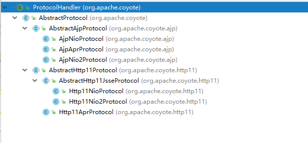
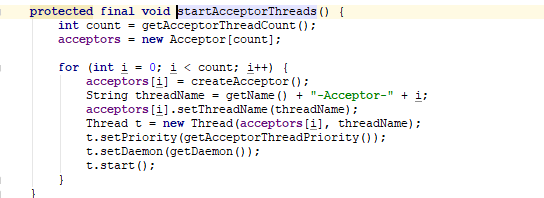

Connector称之为连接器，是Tomcat核心组件之一。<br>
Connector内部维护了两个重要属性：ProtocolHandler和Adapter

Connector自身的init，start均是调用ProtocolHandler的init，start

# 1.ProtocolHandle

ProtcolHandle负责底层IO通讯及应用层协议解析。

ProtocolHandler结构如下：


Nio、Nio2、Apr对应着具体的底层通讯处理方式。<br>
Ajp、Http表示上层解析协议 。

我们继续深入ProtocolHander的子类AbstractProtocol：<br>
AbstractProtocol维护了两个重要属性：<br>
AbstractEndpoint和Handler(**Handler只有一个实现类：AbstractProtocol.ConnectionHandler**)

## 1.1. AbstractEndpoint
AbstractEndpoint负责具体的底层网络通讯。Tomcat支持3中形式的IO通讯：Nio、Nio2和Apr。(*Bio在Tomcat8之后弃用*)<br>
* Nio<br>
Java1.4提供的同步非阻塞通讯，拥有比传统的Bio更好的并发运行性能，Reactor模式。

* Nio2<br>
java1.7之后提供。异步阻塞通讯，Read时不会阻塞，依赖于操作系统调用read的回调函数，Proactor模式。

* Apr<br>
是一个高度可移植的库，Tomcat以JNI的形式调用Apache HTTP服务器的核心动态链接库来处理文件读取或网络传输操作，是在Tomcat上运行高并发应用的首选模式

AbstractEndPoit启动时会执行以下步骤：创建**Acceptor**处理连接接入、Accpetor转发连接至**Poller**处理数据传输。
<br>

此处以NioEndPoint为例：
```java
public final void start() throws Exception {
    if (bindState == BindState.UNBOUND) {
        bind();
        bindState = BindState.BOUND_ON_START;
    }
    startInternal();
}
```

``` java
 public void bind() throws Exception {
    serverSock = ServerSocketChannel.open();
    socketProperties.setProperties(serverSock.socket());
    InetSocketAddress addr = (getAddress()!=null?new InetSocketAddress(getAddress(),getPort()):new InetSocketAddress(getPort()));
    serverSock.socket().bind(addr,getAcceptCount());
    serverSock.configureBlocking(true); //mimic APR behavior,Tomcat的Nio采用的阻塞的方式接受连接？
    serverSock.socket().setSoTimeout(getSocketProperties().getSoTimeout());

    if (acceptorThreadCount == 0) {
        acceptorThreadCount = 1;
    }
    if (pollerThreadCount <= 0) {
        pollerThreadCount = 1;
    }
    stopLatch = new CountDownLatch(pollerThreadCount);
    initialiseSsl();
    selectorPool.open();
}
```
```java
protected class Acceptor extends AbstractEndpoint.Acceptor {
    @Override
    public void run() {
        int errorDelay = 0;
        while (running) {
            //判断socket是否暂停
            while (paused && running) {
                state = AcceptorState.PAUSED;
                try {
                    Thread.sleep(50);
                } catch (InterruptedException e) {
                    // Ignore
                }
            }
            if (!running) {
                break;
            }
            state = AcceptorState.RUNNING;
            try {
                //此处采用LimitLatch控制最大处理连接数
                countUpOrAwaitConnection();
                SocketChannel socket = null;
                try {
                    socket = serverSock.accept();
                } catch (IOException ioe) {  
                    countDownConnection();
                    errorDelay = handleExceptionWithDelay(errorDelay);
                    throw ioe;
                }
                errorDelay = 0;
                if (running && !paused) {
                    //此处将主要处理逻辑，将socket交由Poller处理
                    if (!setSocketOptions(socket)) {
                        countDownConnection();
                        closeSocket(socket);
                    }
                } else {
                    countDownConnection();
                    closeSocket(socket);
                }
            } catch (SocketTimeoutException sx) {
            } catch (IOException x) {
                if (running) {
                    log.error(sm.getString("endpoint.accept.fail"), x);
                }
            } catch (Throwable t) {
                ExceptionUtils.handleThrowable(t);
                log.error(sm.getString("endpoint.accept.fail"), t);
            }
        }
        state = AcceptorState.ENDED;
    }
}
```
```java
 protected boolean setSocketOptions(SocketChannel socket) {
        // Process the connection
        try {
            //disable blocking, APR style, we are gonna be polling it
            socket.configureBlocking(false);
            Socket sock = socket.socket();
            socketProperties.setProperties(sock);

            NioChannel channel = nioChannels.pop();
            if (channel == null) {
                SocketBufferHandler bufhandler = new SocketBufferHandler(
                        socketProperties.getAppReadBufSize(),
                        socketProperties.getAppWriteBufSize(),
                        socketProperties.getDirectBuffer());
                if (isSSLEnabled()) {
                    channel = new SecureNioChannel(socket, bufhandler, selectorPool, this);
                } else {
                    channel = new NioChannel(socket, bufhandler);
                }
            } else {
                channel.setIOChannel(socket);
                channel.reset();
            }
            getPoller0().register(channel);
        } catch (Throwable t) {
            ExceptionUtils.handleThrowable(t);
            try {
                log.error("",t);
            } catch (Throwable tt) {
                ExceptionUtils.handleThrowable(tt);
            }
            // Tell to close the socket
            return false;
        }
        return true;
    }
```
### 1.1.1 Acceptor



### 1.1.2 Poller

## 1.2. ConnectionHandler


# 2.Adapter

Adapter负责将ProtocolHandler生成的Req/Resp转给Container容器处理。


AbstractProtocol包含两个重要属性<br>
1.AbstractEndpoint
2.Adapter


Endpoint中包含Acceptor、Poller
Poller处理完调用SocketProcessor的doRun方法
doRun方法中调用GetHandler.Process，GetHandler是外部类AbstractEndPoint的方法
ConnectionHandler作为实现类
调用Http11Process的process方法

Process调用ProtocolHandler.connectionhandler的process方法