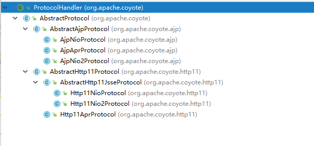
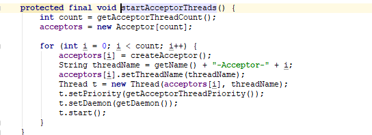
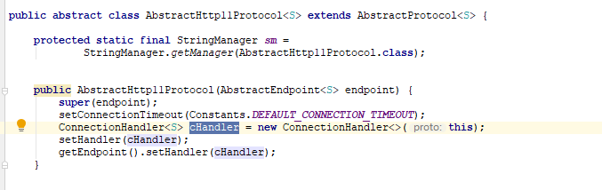
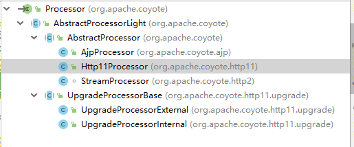

Connector称之为连接器，是Tomcat核心组件之一。<br>
Connector内部维护了两个重要属性：ProtocolHandler和Adapter

Connector自身的init，start均是调用ProtocolHandler的init，start

# 1.ProtocolHandle

ProtcolHandle负责底层IO通讯及应用层协议解析。

ProtocolHandler结构如下：


Nio、Nio2、Apr对应着具体的底层通讯处理方式。<br>
Ajp、Http表示上层解析协议 。

我们继续深入ProtocolHander的子类AbstractProtocol：<br>
AbstractProtocol维护了两个重要属性：<br>
AbstractEndpoint和Handler(**Handler只有一个实现类：AbstractProtocol.ConnectionHandler**)

## 1.1. AbstractEndpoint
AbstractEndpoint负责具体的底层网络通讯。Tomcat支持3中形式的IO通讯：Nio、Nio2和Apr。(*Bio在Tomcat8之后弃用*)<br>
* Nio<br>
Java1.4提供的同步非阻塞通讯，拥有比传统的Bio更好的并发运行性能，Reactor模式。

* Nio2<br>
java1.7之后提供。异步阻塞通讯，Read时不会阻塞，依赖于操作系统调用read的回调函数，Proactor模式。

* Apr<br>
是一个高度可移植的库，Tomcat以JNI的形式调用Apache HTTP服务器的核心动态链接库来处理文件读取或网络传输操作，是在Tomcat上运行高并发应用的首选模式

AbstractEndPoit启动时会执行以下步骤：创建**Acceptor**处理连接接入、Accpetor转发连接至**Poller**处理数据传输。
<br>

此处以NioEndPoint为例：
```java
public final void start() throws Exception {
    if (bindState == BindState.UNBOUND) {
        bind();
        bindState = BindState.BOUND_ON_START;
    }
    startInternal();
}
```

``` java
 public void bind() throws Exception {
    serverSock = ServerSocketChannel.open();
    socketProperties.setProperties(serverSock.socket());
    InetSocketAddress addr = (getAddress()!=null?new InetSocketAddress(getAddress(),getPort()):new InetSocketAddress(getPort()));
    serverSock.socket().bind(addr,getAcceptCount());
    serverSock.configureBlocking(true); //mimic APR behavior,Tomcat的Nio采用的阻塞的方式接受连接？
    serverSock.socket().setSoTimeout(getSocketProperties().getSoTimeout());

    if (acceptorThreadCount == 0) {
        acceptorThreadCount = 1;
    }
    if (pollerThreadCount <= 0) {
        pollerThreadCount = 1;
    }
    stopLatch = new CountDownLatch(pollerThreadCount);
    initialiseSsl();
    selectorPool.open();
}
```
```java
    public void startInternal() throws Exception {

        if (!running) {
            running = true;
            paused = false;

            processorCache = new SynchronizedStack<>(SynchronizedStack.DEFAULT_SIZE,
                    socketProperties.getProcessorCache());
            eventCache = new SynchronizedStack<>(SynchronizedStack.DEFAULT_SIZE,
                            socketProperties.getEventCache());
            nioChannels = new SynchronizedStack<>(SynchronizedStack.DEFAULT_SIZE,
                    socketProperties.getBufferPool());

            //创建工作线程
            if ( getExecutor() == null ) {
                createExecutor();
            }

            //初始化最大连接处理数目
            initializeConnectionLatch();

            // 开启Poller线程
            pollers = new Poller[getPollerThreadCount()];
            for (int i=0; i<pollers.length; i++) {
                pollers[i] = new Poller();
                Thread pollerThread = new Thread(pollers[i], getName() + "-ClientPoller-"+i);
                pollerThread.setPriority(threadPriority);
                pollerThread.setDaemon(true);
                pollerThread.start();
            }

            //开启Accpetor线程
            startAcceptorThreads();
        }
    }
```

### 1.1.1 Acceptor

```java
protected class Acceptor extends AbstractEndpoint.Acceptor {
    @Override
    public void run() {
        int errorDelay = 0;
        while (running) {
            //判断socket是否暂停
            while (paused && running) {
                state = AcceptorState.PAUSED;
                try {
                    Thread.sleep(50);
                } catch (InterruptedException e) {
                    // Ignore
                }
            }
            if (!running) {
                break;
            }
            state = AcceptorState.RUNNING;
            try {
                //此处采用LimitLatch控制最大处理连接数
                countUpOrAwaitConnection();
                SocketChannel socket = null;
                try {
                    socket = serverSock.accept();
                } catch (IOException ioe) {  
                    countDownConnection();
                    errorDelay = handleExceptionWithDelay(errorDelay);
                    throw ioe;
                }
                errorDelay = 0;
                if (running && !paused) {
                    //此处将主要处理逻辑，将socket交由Poller处理
                    if (!setSocketOptions(socket)) {
                        countDownConnection();
                        closeSocket(socket);
                    }
                } else {
                    countDownConnection();
                    closeSocket(socket);
                }
            } catch (SocketTimeoutException sx) {
            } catch (IOException x) {
                if (running) {
                    log.error(sm.getString("endpoint.accept.fail"), x);
                }
            } catch (Throwable t) {
                ExceptionUtils.handleThrowable(t);
                log.error(sm.getString("endpoint.accept.fail"), t);
            }
        }
        state = AcceptorState.ENDED;
    }
}
```
```java
 protected boolean setSocketOptions(SocketChannel socket) {
        // Process the connection
        try {
            //disable blocking, APR style, we are gonna be polling it
            socket.configureBlocking(false);//socket切换成非阻塞模式
            Socket sock = socket.socket();
            socketProperties.setProperties(sock);//设置socket的buffsize、超时、tcpnodelay等属性

            //获取空闲的NioChannel，关联SocketChannel
            NioChannel channel = nioChannels.pop();
            if (channel == null) {
                SocketBufferHandler bufhandler = new SocketBufferHandler(
                        socketProperties.getAppReadBufSize(),
                        socketProperties.getAppWriteBufSize(),
                        socketProperties.getDirectBuffer());
                if (isSSLEnabled()) {
                    channel = new SecureNioChannel(socket, bufhandler, selectorPool, this);
                } else {
                    channel = new NioChannel(socket, bufhandler);
                }
            } else {
                channel.setIOChannel(socket);
                channel.reset();
            }
            //获取可用的Poller对象，并在之上注册NioChannel对象
            getPoller0().register(channel);
        } catch (Throwable t) {
            ExceptionUtils.handleThrowable(t);
            try {
                log.error("",t);
            } catch (Throwable tt) {
                ExceptionUtils.handleThrowable(tt);
            }
            // Tell to close the socket
            return false;
        }
        return true;
    }
```

### 1.1.2 Poller
Poller对象负责socket数据传输，每个Poller内置一个Selector对象。<br>
register方法只是将NioChannel包装成一个NioSocketWrapper对象，然后new了一个PollerEvent对象
扔到一个队列中。<br>

这样设计的目的应该是register是有setSocketOptions调用，而setSocketOptions又是在Accerptor线程中调用，所以必须通过另一个线程也就是Poller线程执行。

```java
 public void register(final NioChannel socket) {
    socket.setPoller(this);//设置该niochennel所属Poller

    //NioSocketWrapper作为socket通讯的attchment，包含Niochannel及NioEndPoint
    NioSocketWrapper ka = new NioSocketWrapper(socket, NioEndpoint.this);
    socket.setSocketWrapper(ka);//多余，应该在NioSocketWrapper的构造函数中设置
    ka.setPoller(this);
    ka.setReadTimeout(getSocketProperties().getSoTimeout());
    ka.setWriteTimeout(getSocketProperties().getSoTimeout());
    ka.setKeepAliveLeft(NioEndpoint.this.getMaxKeepAliveRequests());
    ka.setSecure(isSSLEnabled());
    ka.setReadTimeout(getConnectionTimeout());
    ka.setWriteTimeout(getConnectionTimeout());

    //获取一个空闲的PollEvent对象(类似NioChannel、SocketProcess等对象的获取，池化对象提升性能)
    PollerEvent r = eventCache.pop();
    //注册Read的interest事件
    ka.interestOps(SelectionKey.OP_READ);

    if ( r==null) r = new PollerEvent(socket,ka,OP_REGISTER);//？
    else r.reset(socket,ka,OP_REGISTER);
    addEvent(r);
}

 private void addEvent(PollerEvent event) {
    events.offer(event);

    //1.如果调用incrementAndGet==0，则Poller的run方法正好执行到 wakeupCounter.getAndSet(-1)且结果等于0，run方法会执行到selector.select(selectorTimeout);所以需要立即唤醒
    //2.incrementAndGet>0,表明队列中PollerEvent元素很多，Poller的Run方法会执行selector.selectNow();无需担心
    //3.incrementAndGet=-1，PollerEvent元素很少，Poller的Run方法select阻塞等待。
    if ( wakeupCounter.incrementAndGet() == 0 ) selector.wakeup();//立即唤醒
    selector
}
```

```java
public void run() {
        while (true) {
            boolean hasEvents = false;
            try {
                if (!close) {
                    hasEvents = events();//TODO event需要研究下，先跳过
                    if (wakeupCounter.getAndSet(-1) > 0) {
                        //wakeupCounter设置为-1仍旧>0，表明有其他事件到达，立即调用selectNow唤醒
                        keyCount = selector.selectNow();
                    } else {
                        //阻塞等待超时
                        keyCount = selector.select(selectorTimeout);
                    }
                    wakeupCounter.set(0);
                }
                if (close) {
                    events();
                    timeout(0, false);
                    try {
                        selector.close();
                    } catch (IOException ioe) {
                        log.error(sm.getString("endpoint.nio.selectorCloseFail"), ioe);
                    }
                    break;
                }
            } catch (Throwable x) {
                ExceptionUtils.handleThrowable(x);
                log.error("",x);
                continue;
            }
            //不管超时还是被唤醒，都必须调用events
            if ( keyCount == 0 ) hasEvents = (hasEvents | events());

            Iterator<SelectionKey> iterator =
                keyCount > 0 ? selector.selectedKeys().iterator() : null;
            // 遍历ready集合
            while (iterator != null && iterator.hasNext()) {
                SelectionKey sk = iterator.next();
                NioSocketWrapper attachment = (NioSocketWrapper)sk.attachment();
                // 当其他线程调用cancelledKey后，attchment为null
                if (attachment == null) {
                    iterator.remove();
                } else {
                    iterator.remove();
                    processKey(sk, attachment);
                }
            }
            //超时检测
            timeout(keyCount,hasEvents);
        }//while

        stopLatch.countDown();
    }

protected void processKey(SelectionKey sk, NioSocketWrapper attachment) {
    try {
        if ( close ) {
            cancelledKey(sk);
        } else if ( sk.isValid() && attachment != null ) {
            if (sk.isReadable() || sk.isWritable() ) {
                if ( attachment.getSendfileData() != null ) {
                    processSendfile(sk,attachment, false);
                } else {
                    unreg(sk, attachment, sk.readyOps());
                    boolean closeSocket = false;
                    // Read goes before write
                    if (sk.isReadable()) {
                        if (!processSocket(attachment, SocketEvent.OPEN_READ, true)) {
                            closeSocket = true;
                        }
                    }
                    if (!closeSocket && sk.isWritable()) {
                        if (!processSocket(attachment, SocketEvent.OPEN_WRITE, true)) {
                            closeSocket = true;
                        }
                    }
                    if (closeSocket) {
                        cancelledKey(sk);
                    }
                }
            }
        } else {
            //invalid key
            cancelledKey(sk);
        }
    } catch ( CancelledKeyException ckx ) {
        cancelledKey(sk);
    } catch (Throwable t) {
        ExceptionUtils.handleThrowable(t);
        log.error("",t);
    }
}
```

processSocket虽然经由Poller线程调用，但方法实现在AbstractEndPoint中
```java

//传递过来的参数 event：SocketEvent.OPEN_READ ；dispatch：true
public boolean processSocket(SocketWrapperBase<S> socketWrapper,
            SocketEvent event, boolean dispatch) {
    try {
        if (socketWrapper == null) {
            return false;
        }
        SocketProcessorBase<S> sc = processorCache.pop();
        if (sc == null) {
            sc = createSocketProcessor(socketWrapper, event);
        } else {
            sc.reset(socketWrapper, event);
        }
        Executor executor = getExecutor();
        if (dispatch && executor != null) {
            executor.execute(sc);
        } else {
            sc.run();
        }
    } catch (RejectedExecutionException ree) {
        getLog().warn(sm.getString("endpoint.executor.fail", socketWrapper) , ree);
        return false;
    } catch (Throwable t) {
        ExceptionUtils.handleThrowable(t);
        // This means we got an OOM or similar creating a thread, or that
        // the pool and its queue are full
        getLog().error(sm.getString("endpoint.process.fail"), t);
        return false;
    }
    return true;
}
```
此处以Nio中的SocketProcessor为例：
```java
protected void doRun() {
    NioChannel socket = socketWrapper.getSocket();
    SelectionKey key = socket.getIOChannel().keyFor(socket.getPoller().getSelector());

    try {
        int handshake = -1;

        try {
            if (key != null) {
                //？此处貌似有握手等判断
                if (socket.isHandshakeComplete()) {
                    // No TLS handshaking required. Let the handler
                    // process this socket / event combination.
                    handshake = 0;
                } else if (event == SocketEvent.STOP || event == SocketEvent.DISCONNECT ||
                        event == SocketEvent.ERROR) {
                    // Unable to complete the TLS handshake. Treat it as
                    // if the handshake failed.
                    handshake = -1;
                } else {
                    handshake = socket.handshake(key.isReadable(), key.isWritable());
                    // The handshake process reads/writes from/to the
                    // socket. status may therefore be OPEN_WRITE once
                    // the handshake completes. However, the handshake
                    // happens when the socket is opened so the status
                    // must always be OPEN_READ after it completes. It
                    // is OK to always set this as it is only used if
                    // the handshake completes.
                    event = SocketEvent.OPEN_READ;
                }
            }
        } catch (IOException x) {
            handshake = -1;
            if (log.isDebugEnabled()) log.debug("Error during SSL handshake",x);
        } catch (CancelledKeyException ckx) {
            handshake = -1;
        }
        //正常情况下走该分支
        if (handshake == 0) {
            SocketState state = SocketState.OPEN;
            // SocketProcessor作为NioEndPoint的内部类，getHandler获取了EndPoint的ConnectionHandler对象!
            if (event == null) {
                state = getHandler().process(socketWrapper, SocketEvent.OPEN_READ);
            } else {
                state = getHandler().process(socketWrapper, event);
            }
            if (state == SocketState.CLOSED) {
                close(socket, key);
            }
        } else if (handshake == -1 ) {
            close(socket, key);
        } else if (handshake == SelectionKey.OP_READ){
            socketWrapper.registerReadInterest();
        } else if (handshake == SelectionKey.OP_WRITE){
            socketWrapper.registerWriteInterest();
        }
    } catch (CancelledKeyException cx) {
        socket.getPoller().cancelledKey(key);
    } catch (VirtualMachineError vme) {
        ExceptionUtils.handleThrowable(vme);
    } catch (Throwable t) {
        log.error("", t);
        socket.getPoller().cancelledKey(key);
    } finally {
        socketWrapper = null;
        event = null;
        //return to cache
        if (running && !paused) {
            processorCache.push(this);
        }
    }
}
```
## 1.2. ConnectionHandler
ConnectionHandler对象的初始化，所以上述EndPoint通过getHandle可以获取到ConnectionHandler对象。<br>
)
```java
public SocketState process(SocketWrapperBase<S> wrapper, SocketEvent status) {
            if (getLog().isDebugEnabled()) {
                getLog().debug(sm.getString("abstractConnectionHandler.process",
                        wrapper.getSocket(), status));
            }
            if (wrapper == null) {
                // Nothing to do. Socket has been closed.
                return SocketState.CLOSED;
            }

            S socket = wrapper.getSocket();//此处是NioChannel

            Processor processor = connections.get(socket);
            if ((status == SocketEvent.DISCONNECT || status == SocketEvent.ERROR)
                    && processor == null) {
                // Nothing to do. Endpoint requested a close and there is no
                // longer a processor associated with this socket.
                return SocketState.CLOSED;
            }

            ContainerThreadMarker.set();

            try {
                if (processor == null) {
                    String negotiatedProtocol = wrapper.getNegotiatedProtocol();
                    if (negotiatedProtocol != null) {
                        UpgradeProtocol upgradeProtocol =
                                getProtocol().getNegotiatedProtocol(negotiatedProtocol);
                        if (upgradeProtocol != null) {
                            processor = upgradeProtocol.getProcessor(
                                    wrapper, getProtocol().getAdapter());
                        } else if (negotiatedProtocol.equals("http/1.1")) {
                            // Explicitly negotiated the default protocol.
                            // Obtain a processor below.
                        } else {
                            // TODO:
                            // OpenSSL 1.0.2's ALPN callback doesn't support
                            // failing the handshake with an error if no
                            // protocol can be negotiated. Therefore, we need to
                            // fail the connection here. Once this is fixed,
                            // replace the code below with the commented out
                            // block.
                            if (getLog().isDebugEnabled()) {
                                getLog().debug(sm.getString(
                                    "abstractConnectionHandler.negotiatedProcessor.fail",
                                    negotiatedProtocol));
                            }
                            return SocketState.CLOSED;
                            /*
                             * To replace the code above once OpenSSL 1.1.0 is
                             * used.
                            // Failed to create processor. This is a bug.
                            throw new IllegalStateException(sm.getString(
                                    "abstractConnectionHandler.negotiatedProcessor.fail",
                                    negotiatedProtocol));
                            */
                        }
                    }
                }
                if (processor == null) {
                    processor = recycledProcessors.pop();
                }
                if (processor == null) {
                    processor = getProtocol().createProcessor();
                    register(processor);
                }

                processor.setSslSupport(
                        wrapper.getSslSupport(getProtocol().getClientCertProvider()));

                // Associate the processor with the connection
                connections.put(socket, processor);
                // Make sure an async timeout doesn't fire
                getProtocol().removeWaitingProcessor(processor);

                SocketState state = SocketState.CLOSED;
                do {
                    state = processor.process(wrapper, status);

                    if (state == SocketState.UPGRADING) {
                        // Get the HTTP upgrade handler
                        UpgradeToken upgradeToken = processor.getUpgradeToken();
                        // Retrieve leftover input
                        ByteBuffer leftOverInput = processor.getLeftoverInput();
                        if (upgradeToken == null) {
                            // Assume direct HTTP/2 connection
                            UpgradeProtocol upgradeProtocol = getProtocol().getUpgradeProtocol("h2c");
                            if (upgradeProtocol != null) {
                                processor = upgradeProtocol.getProcessor(
                                        wrapper, getProtocol().getAdapter());
                                wrapper.unRead(leftOverInput);
                                // Associate with the processor with the connection
                                connections.put(socket, processor);
                            } else {
                                if (getLog().isDebugEnabled()) {
                                    getLog().debug(sm.getString(
                                        "abstractConnectionHandler.negotiatedProcessor.fail",
                                        "h2c"));
                                }
                                return SocketState.CLOSED;
                            }
                        } else {
                            HttpUpgradeHandler httpUpgradeHandler = upgradeToken.getHttpUpgradeHandler();
                            // Release the Http11 processor to be re-used
                            release(processor);
                            // Create the upgrade processor
                            processor = getProtocol().createUpgradeProcessor(wrapper, upgradeToken);
                            wrapper.unRead(leftOverInput);
                            // Mark the connection as upgraded
                            wrapper.setUpgraded(true);
                            // Associate with the processor with the connection
                            connections.put(socket, processor);
                            // Initialise the upgrade handler (which may trigger
                            // some IO using the new protocol which is why the lines
                            // above are necessary)
                            // This cast should be safe. If it fails the error
                            // handling for the surrounding try/catch will deal with
                            // it.
                            if (upgradeToken.getInstanceManager() == null) {
                                httpUpgradeHandler.init((WebConnection) processor);
                            } else {
                                ClassLoader oldCL = upgradeToken.getContextBind().bind(false, null);
                                try {
                                    httpUpgradeHandler.init((WebConnection) processor);
                                } finally {
                                    upgradeToken.getContextBind().unbind(false, oldCL);
                                }
                            }
                        }
                    }
                } while ( state == SocketState.UPGRADING);

                if (state == SocketState.LONG) {
                    // In the middle of processing a request/response. Keep the
                    // socket associated with the processor. Exact requirements
                    // depend on type of long poll
                    longPoll(wrapper, processor);
                    if (processor.isAsync()) {
                        getProtocol().addWaitingProcessor(processor);
                    }
                } else if (state == SocketState.OPEN) {
                    // In keep-alive but between requests. OK to recycle
                    // processor. Continue to poll for the next request.
                    connections.remove(socket);
                    release(processor);
                    wrapper.registerReadInterest();
                } else if (state == SocketState.SENDFILE) {
                    // Sendfile in progress. If it fails, the socket will be
                    // closed. If it works, the socket will be re-added to the
                    // poller
                    connections.remove(socket);
                    release(processor);
                } else if (state == SocketState.UPGRADED) {
                    // Don't add sockets back to the poller if this was a
                    // non-blocking write otherwise the poller may trigger
                    // multiple read events which may lead to thread starvation
                    // in the connector. The write() method will add this socket
                    // to the poller if necessary.
                    if (status != SocketEvent.OPEN_WRITE) {
                        longPoll(wrapper, processor);
                    }
                } else {
                    // Connection closed. OK to recycle the processor. Upgrade
                    // processors are not recycled.
                    connections.remove(socket);
                    if (processor.isUpgrade()) {
                        UpgradeToken upgradeToken = processor.getUpgradeToken();
                        HttpUpgradeHandler httpUpgradeHandler = upgradeToken.getHttpUpgradeHandler();
                        InstanceManager instanceManager = upgradeToken.getInstanceManager();
                        if (instanceManager == null) {
                            httpUpgradeHandler.destroy();
                        } else {
                            ClassLoader oldCL = upgradeToken.getContextBind().bind(false, null);
                            try {
                                httpUpgradeHandler.destroy();
                            } finally {
                                try {
                                    instanceManager.destroyInstance(httpUpgradeHandler);
                                } catch (Throwable e) {
                                    ExceptionUtils.handleThrowable(e);
                                    getLog().error(sm.getString("abstractConnectionHandler.error"), e);
                                }
                                upgradeToken.getContextBind().unbind(false, oldCL);
                            }
                        }
                    } else {
                        release(processor);
                    }
                }
                return state;
            } catch(java.net.SocketException e) {
                // SocketExceptions are normal
                getLog().debug(sm.getString(
                        "abstractConnectionHandler.socketexception.debug"), e);
            } catch (java.io.IOException e) {
                // IOExceptions are normal
                getLog().debug(sm.getString(
                        "abstractConnectionHandler.ioexception.debug"), e);
            } catch (ProtocolException e) {
                // Protocol exceptions normally mean the client sent invalid or
                // incomplete data.
                getLog().debug(sm.getString(
                        "abstractConnectionHandler.protocolexception.debug"), e);
            }
            // Future developers: if you discover any other
            // rare-but-nonfatal exceptions, catch them here, and log as
            // above.
            catch (Throwable e) {
                ExceptionUtils.handleThrowable(e);
                // any other exception or error is odd. Here we log it
                // with "ERROR" level, so it will show up even on
                // less-than-verbose logs.
                getLog().error(sm.getString("abstractConnectionHandler.error"), e);
            } finally {
                ContainerThreadMarker.clear();
            }

            // Make sure socket/processor is removed from the list of current
            // connections
            connections.remove(socket);
            release(processor);
            return SocketState.CLOSED;
        }
```
可以看到ConnectionHandler把具体的规约解析交由Processor处理，Porcessor结构如下：

### 1.2.1 Processor
此处以Http11Processor为例，主要负责http协议解析，并组织成Req，Resp对象交给Adapter处理。<br>
由具体子类实现service方法，方法太长今天就不细细分析了，大体流程<br>

1.Procesor对象在AbstractHttp11Protocol的createProcessor中生成<br>
2.AbstractProcessor初始化时，构造函数有3个:EndPoint,new Req,new Resp

* Request


* Response


```java
 public SocketState process(SocketWrapperBase<?> socketWrapper, SocketEvent status)
            throws IOException {

        SocketState state = SocketState.CLOSED;
        Iterator<DispatchType> dispatches = null;
        do {
            if (dispatches != null) {
                DispatchType nextDispatch = dispatches.next();
                state = dispatch(nextDispatch.getSocketStatus());
            } else if (status == SocketEvent.DISCONNECT) {
                // Do nothing here, just wait for it to get recycled
            } else if (isAsync() || isUpgrade() || state == SocketState.ASYNC_END) {
                state = dispatch(status);
                if (state == SocketState.OPEN) {
                    // There may be pipe-lined data to read. If the data isn't
                    // processed now, execution will exit this loop and call
                    // release() which will recycle the processor (and input
                    // buffer) deleting any pipe-lined data. To avoid this,
                    // process it now.
                    state = service(socketWrapper);
                }
            } else if (status == SocketEvent.OPEN_WRITE) {
                // Extra write event likely after async, ignore
                state = SocketState.LONG;
            } else {
                state = service(socketWrapper);
            }

            if (state != SocketState.CLOSED && isAsync()) {
                state = asyncPostProcess();
            }

            if (getLog().isDebugEnabled()) {
                getLog().debug("Socket: [" + socketWrapper +
                        "], Status in: [" + status +
                        "], State out: [" + state + "]");
            }

            if (dispatches == null || !dispatches.hasNext()) {
                // Only returns non-null iterator if there are
                // dispatches to process.
                dispatches = getIteratorAndClearDispatches();
            }
        } while (state == SocketState.ASYNC_END ||
                dispatches != null && state != SocketState.CLOSED);

        return state;
    }
```
//TODO 明天继续看Process中的service方法，晚安。
Processor另起一篇
[Tomcat之HttpProcessor](Tomcat-Connector-Httpprocessor.md)

# 2.Adapter

Adapter负责将ProtocolHandler生成的Req/Resp转给Container容器处理。
