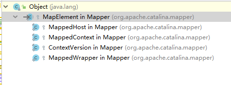

上篇分析到StandardService类时，需要主要到Service有两个重要的属性
```java
protected final Mapper mapper = new Mapper();
protected final MapperListener mapperListener = new MapperListener(this);
```

# 简述
* Mapper
> Mapper:实现了servlet API的路由规则(根据Http规则)。

通俗的说就是当客户端发出请求/example/lession1/part1时，web服务器能够正确的找到对应的servlet执行，

查找servlet的过程就称之为路由。(host-->context-->Warpper)

* MapperListener

由于用户可以随时增加一个虚拟主机(host),或者在host中增加一个应用程序(context),或者在context中增加一个servelet。

当有上述操作发生时，Tomcat需要一种机制及时检测到变更、维护正确的路由规则。

这就是MapperListener的作用。

从MapperListener类的接口继承可以看出来,既继承了ContainerListener(关注children的变更)，又继承了LifecycleListener(关注容器状态的变更)
```java
public class MapperListener extends LifecycleMBeanBase implements ContainerListener, LifecycleListener
```


# Mapper层次结构

Mapper采用以下层次结构搭建了针对Tomcat的路由规则：


---
* MapElment是所有元素的基类。含有name(host的名称/context的路径等)和对应的泛型对象
* MappedHost含有ContextList的集合，保存该虚拟主机下的所有context的有序集合。
* ContextList含有MappedContext数组和nesting(所有context的path中，最多的“/”数目)
* MappedContext包含ContextVersion数组，表示不同版本的context
* ContextVersion 包含以下属性
    1. path
    2. slashCount
    3. WebResourceRoot
    4. welcomeResources的字符数组
    5. defaultWrapper：默认的wrapper
    6. exactWrappers：对wrapper的精确匹配
    7. wildcardWrappers：基于通配符的匹配
    8. extensionWrappers:基于扩展名的匹配
    9. nesting
* MappedWrapper
    1. jspWildCard
    2. resourceOnly

好了，基本的路由结构讲完了，还是从mapper的start方法开启入口。。。
# MapperListener
首先分析startInternal方法，主要有以下步骤
* 查找defaultHost，并设置mapper的defaultHost
* 给Engine及其所有下级容器添加mapperListener监听器(这样所有的容器变更，路由规则都能及时更新)
* 将host及其所有下级容器注册到mapper对象

## MapperListen.startInternal
```java
public void startInternal() throws LifecycleException {

    setState(LifecycleState.STARTING);

    Engine engine = service.getContainer();
    if (engine == null) {
        return;
    }

    findDefaultHost();

    //给engine及所有下级添加该监听器(递归调用)，
    //这样所有Tomcat的组件都处于mapper的监听之下，只要有变更，都能正确的路由到。
    addListeners(engine);

    Container[] conHosts = engine.findChildren();
    for (Container conHost : conHosts) {
        Host host = (Host) conHost;
        if (!LifecycleState.NEW.equals(host.getState())) {
            //host及其所有下级注册到mapper
            registerHost(host);
        }
    }
}
//获取默认的host名称
 private void findDefaultHost() {

    Engine engine = service.getContainer();

    //来自于<Engine name="Catalina" defaultHost="localhost">
    String defaultHost = engine.getDefaultHost();

    boolean found = false;

    if (defaultHost != null && defaultHost.length() >0) {
        Container[] containers = engine.findChildren();

        //遍历所有下级Host,查找名称/别名是否有默认host匹配
        for (Container container : containers) {
            Host host = (Host) container;
            if (defaultHost.equalsIgnoreCase(host.getName())) {
                found = true;
                break;
            }

            String[] aliases = host.findAliases();
            for (String alias : aliases) {
                if (defaultHost.equalsIgnoreCase(alias)) {
                    found = true;
                    break;
                }
            }
        }
    }

    if(found) {
        //设置mapper的默认host，此处会遍历mapper所有注册元素
        mapper.setDefaultHostName(defaultHost);
    } else {
        log.warn(sm.getString("mapperListener.unknownDefaultHost",
                defaultHost, service));
    }
}
private void addListeners(Container container) {
    container.addContainerListener(this);
    container.addLifecycleListener(this);
    //递归下级，直至所以子容器都添加MapperListener
    for (Container child : container.findChildren()) {
        addListeners(child);
    }
}
```

### Host注册
```java
//注册host
private void registerHost(Host host) {

    String[] aliases = host.findAliases();
    //将host注册到mapper
    mapper.addHost(host.getName(), aliases, host);

    //将host的下级context注册到mapper
    for (Container container : host.findChildren()) {
        if (container.getState().isAvailable()) {
            registerContext((Context) container);
        }
    }
    if(log.isDebugEnabled()) {
        log.debug(sm.getString("mapperListener.registerHost",
                host.getName(), domain, service));
    }
}

//将host加入到mapper元素中
public synchronized void addHost(String name, String[] aliases,
                                     Host host) {
    //去除通配符。将形如 *.apache.org 格式的字符串转成 .apache.org            
    name = renameWildcardHost(name);
    //分配新的MappedHost数组
    MappedHost[] newHosts = new MappedHost[hosts.length + 1];
    //新建一个新的MappedHost元素
    MappedHost newHost = new MappedHost(name, host);
    if (insertMap(hosts, newHosts, newHost)) {
        hosts = newHosts;
        if (newHost.name.equals(defaultHostName)) {
            defaultHost = newHost;
        }
        if (log.isDebugEnabled()) {
            log.debug(sm.getString("mapper.addHost.success", name));
        }
    } else {
        MappedHost duplicate = hosts[find(hosts, name)];
        if (duplicate.object == host) {
            if (log.isDebugEnabled()) {
                log.debug(sm.getString("mapper.addHost.sameHost", name));
            }
            newHost = duplicate;
        } else {
            log.error(sm.getString("mapper.duplicateHost", name,
                    duplicate.getRealHostName()));
            return;
        }
    }
    List<MappedHost> newAliases = new ArrayList<>(aliases.length);
    //此处遍历所有的别名，针对别名新建host对象，感觉有点重复
    for (String alias : aliases) {
        alias = renameWildcardHost(alias);
        MappedHost newAlias = new MappedHost(alias, newHost);
        if (addHostAliasImpl(newAlias)) {
            newAliases.add(newAlias);
        }
    }
    newHost.addAliases(newAliases);
}

private static final <T> boolean insertMap
    (MapElement<T>[] oldMap, MapElement<T>[] newMap, MapElement<T> newElement) {
    //在oldMap中查找要插入的Host元素,采用的二分查找。
    int pos = find(oldMap, newElement.name);
    //如果找到且元素相同，则返回-1（重复错误)
    if ((pos != -1) && (newElement.name.equals(oldMap[pos].name))) {
        return false;
    }
    System.arraycopy(oldMap, 0, newMap, 0, pos + 1);
    newMap[pos + 1] = newElement;
    System.arraycopy
        (oldMap, pos + 1, newMap, pos + 2, oldMap.length - pos - 1);
    return true;
}

//二分查找
 private static final <T> int find(MapElement<T>[] map, String name) {

    int a = 0;
    int b = map.length - 1;

    // Special cases: -1 and 0
    if (b == -1) {
        return -1;
    }

    if (name.compareTo(map[0].name) < 0) {
        return -1;
    }
    if (b == 0) {
        return 0;
    }

    int i = 0;
    while (true) {
        i = (b + a) / 2;
        int result = name.compareTo(map[i].name);
        if (result > 0) {
            a = i;
        } else if (result == 0) {
            return i;
        } else {
            b = i;
        }
        if ((b - a) == 1) {
            int result2 = name.compareTo(map[b].name);
            if (result2 < 0) {
                return a;
            } else {
                return b;
            }
        }
    }

}
```


## Context注册

## Wrapper注册

上面是启动时候的一系列操作，当容器元素变更时呢?
```java
public void containerEvent(ContainerEvent event) {

        if (Container.ADD_CHILD_EVENT.equals(event.getType())) {
            Container child = (Container) event.getData();
            addListeners(child);
            // If child is started then it is too late for life-cycle listener
            // to register the child so register it here
            if (child.getState().isAvailable()) {
                if (child instanceof Host) {
                    registerHost((Host) child);
                } else if (child instanceof Context) {
                    registerContext((Context) child);
                } else if (child instanceof Wrapper) {
                    // Only if the Context has started. If it has not, then it
                    // will have its own "after_start" life-cycle event later.
                    if (child.getParent().getState().isAvailable()) {
                        registerWrapper((Wrapper) child);
                    }
                }
            }
        } else if (Container.REMOVE_CHILD_EVENT.equals(event.getType())) {
            Container child = (Container) event.getData();
            removeListeners(child);
            // No need to unregister - life-cycle listener will handle this when
            // the child stops
        } else if (Host.ADD_ALIAS_EVENT.equals(event.getType())) {
            // Handle dynamically adding host aliases
            mapper.addHostAlias(((Host) event.getSource()).getName(),
                    event.getData().toString());
        } else if (Host.REMOVE_ALIAS_EVENT.equals(event.getType())) {
            // Handle dynamically removing host aliases
            mapper.removeHostAlias(event.getData().toString());
        } else if (Wrapper.ADD_MAPPING_EVENT.equals(event.getType())) {
            // Handle dynamically adding wrappers
            Wrapper wrapper = (Wrapper) event.getSource();
            Context context = (Context) wrapper.getParent();
            String contextPath = context.getPath();
            if ("/".equals(contextPath)) {
                contextPath = "";
            }
            String version = context.getWebappVersion();
            String hostName = context.getParent().getName();
            String wrapperName = wrapper.getName();
            String mapping = (String) event.getData();
            boolean jspWildCard = ("jsp".equals(wrapperName)
                    && mapping.endsWith("/*"));
            mapper.addWrapper(hostName, contextPath, version, mapping, wrapper,
                    jspWildCard, context.isResourceOnlyServlet(wrapperName));
        } else if (Wrapper.REMOVE_MAPPING_EVENT.equals(event.getType())) {
            // Handle dynamically removing wrappers
            Wrapper wrapper = (Wrapper) event.getSource();

            Context context = (Context) wrapper.getParent();
            String contextPath = context.getPath();
            if ("/".equals(contextPath)) {
                contextPath = "";
            }
            String version = context.getWebappVersion();
            String hostName = context.getParent().getName();

            String mapping = (String) event.getData();

            mapper.removeWrapper(hostName, contextPath, version, mapping);
        } else if (Context.ADD_WELCOME_FILE_EVENT.equals(event.getType())) {
            // Handle dynamically adding welcome files
            Context context = (Context) event.getSource();

            String hostName = context.getParent().getName();

            String contextPath = context.getPath();
            if ("/".equals(contextPath)) {
                contextPath = "";
            }

            String welcomeFile = (String) event.getData();

            mapper.addWelcomeFile(hostName, contextPath,
                    context.getWebappVersion(), welcomeFile);
        } else if (Context.REMOVE_WELCOME_FILE_EVENT.equals(event.getType())) {
            // Handle dynamically removing welcome files
            Context context = (Context) event.getSource();

            String hostName = context.getParent().getName();

            String contextPath = context.getPath();
            if ("/".equals(contextPath)) {
                contextPath = "";
            }

            String welcomeFile = (String) event.getData();

            mapper.removeWelcomeFile(hostName, contextPath,
                    context.getWebappVersion(), welcomeFile);
        } else if (Context.CLEAR_WELCOME_FILES_EVENT.equals(event.getType())) {
            // Handle dynamically clearing welcome files
            Context context = (Context) event.getSource();

            String hostName = context.getParent().getName();

            String contextPath = context.getPath();
            if ("/".equals(contextPath)) {
                contextPath = "";
            }

            mapper.clearWelcomeFiles(hostName, contextPath,
                    context.getWebappVersion());
        }
    }
```
代码还是很好理解的，容器变更时首先判断变更类型，如添加、删除

添加/删除时判断容器类型，是host还是context、Wrapper，