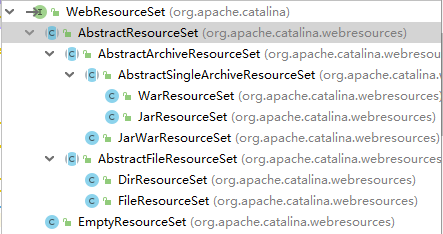

StandardRoot继承WebResourceRoot<br>
WebResourceRoot表示一个完整的web项目的资源集合，WebResourceRoot包含一系列WebResourceSets对象属性。分别表示不同类型的资源文件。

# WebResourceSets

从结构图可以看出来，资源从类型上划分了以下几种
* 归档文件
    * war文件
    * jar文件
* 普通文件
    * 文件
    * 文件夹
* 空文件

## startInternal
```java
protected void startInternal() throws LifecycleException {
    mainResources.clear();

    main = createMainResourceSet();

    mainResources.add(main);

    for (List<WebResourceSet> list : allResources) {
        //略过class资源文件，后面会开启
        if (list != classResources) {
            for (WebResourceSet webResourceSet : list) {
                webResourceSet.start();
            }
        }
    }

    // This has to be called after the other resources have been started
    // else it won't find all the matching resources
    processWebInfLib();
    // Need to start the newly found resources
    for (WebResourceSet classResource : classResources) {
        classResource.start();
    }

    cache.enforceObjectMaxSizeLimit();

    setState(LifecycleState.STARTING);
}
```