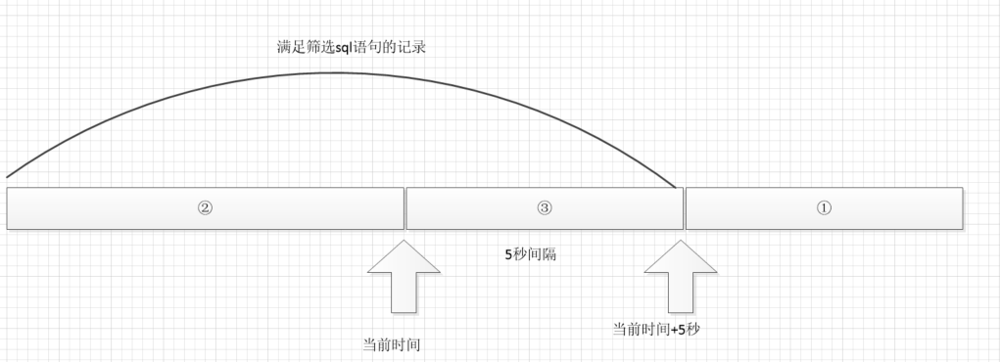

本篇主要分析下`xxl-job`的原理
---

xxl-job：

1. `XxlJobInfo`表示一个可执行的任务，对应表`xxl_job_info`。该表上的`job_group`代表对应的执行器，即该任务交由哪个执行器执行

2. `XxlJobGroup`表示一个执行器，对应表`xxl_job_group`，该表上的`address_list`表示该执行器上所有的执行机器，多台机器以逗号分隔。

**注意：调度所涉及的路由策略，仅仅是针对单个执行器上的多个机器路由，而不是在多个执行器间路由**

***

首先启动`xxl-job-admin`调度中心

根据控制台日志打印的字符`>>>>>>>>> init xxl-job admin success.`,可以找到程序的入口类`XxlJobAdminConfig`,

```java
public void afterPropertiesSet() throws Exception {
    adminConfig = this;

    xxlJobScheduler = new XxlJobScheduler();
    xxlJobScheduler.init();
}
```
**Spring学习点**:
>   1.为什么初始化会进入XxlJobAdminConfig的afterPropertiesSet方法

>   2.为什么 XxlJobAdminConfig 继承了InitializingBean ，并且添加了Component

***

首先调用了`XxlJobScheduler`的`init`方法,`init`方法如下

```java
public void init() throws Exception {
    //1.初始化国际化相关配置
    initI18n();

    //2.开启注册监控
    JobRegistryMonitorHelper.getInstance().start();

    //3.开启失败监控
    JobFailMonitorHelper.getInstance().start();

    //4.开启执行器
    JobTriggerPoolHelper.toStart();

    //5.开启日志上报
    JobLogReportHelper.getInstance().start();

    //6.开启调度器
    JobScheduleHelper.getInstance().start();

    logger.info(">>>>>>>>> init xxl-job admin success.");
}
```
## 1. JobRegistryMonitorHelper

`JobRegistryMonitorHelper`是一个后台轮询线程，一直在后台执行下列逻辑：


        1. 找出`xxl_job_group`中所有执行器类型是自动注册的执行器，如果无记录则返回。

        2. 删除所有已死亡的()`xxl_job_registry`记录。判断依据:最后一次更新时间距离当前时间相差90s，这里使用了date_add函数。

        3. 找到存活的执行器，针对所有`registry_group`等于`EXECUTOR`的记录，将`registry_key`，`registry_value`组织成`key:appName,value:List<registryList>`的形式

        4. 遍历步骤1中的`groupList`,将`group`对象中的`setAddressList`更新成步骤3中的`key-value`中的`value`值。

**总结：`JobRegistryMonitorHelper`做了两件事**
1. 删除`xxl_job_registry`中无效的记录
2. 更新`xxl_job_group`中的`address_list`,其中`address_list`来自于`xxl_job_registry`的`registry_value`

## 2. JobFailMonitorHelper

查找日志表中所有非成功的且告警状态为默认的前1000条记录，遍历记录执行下面的逻辑：

    * 将告警状态为0的记录更新为-1，更新失败则退出，
      (告警状态：0-默认、-1=锁定状态、1-无需告警、2-告警成功、3-告警失败)
    * 根据日志id找到`jobinfo`
    * 如果日志失败重试次数>0,则调用`JobTriggerPoolHelper.addTrigger`
    * 如果`jobinfo`的告警邮箱不为空，则调用job.alarm
    * 更新告警状态

**总结：`JobFailMonitorHelper`执行以下流程**
1. 更新告警状态为-1（用于锁定log中的记录）
2. 根据重试次数，添加触发器
3. 判断是否有邮箱，调用告警
4. 更新告警状态-1为新的状态值

## 3. JobTriggerPoolHelper

     `JobTriggerPoolHelper`的`start`方法，新建两个线程池:`fastTriggerPool`和`slowTriggerPool`，执行调度的时候会根据执行的频率选择不同的线程池

    传递过来的任务会经由XxlJobTrigger.trigger(jobId, triggerType, failRetryCount, executorShardingParam, executorParam);执行

## 4. JobLogReportHelper

    * 对最近三天的日志记录进行更新。from：每天的零点，to:每天的23:59：59

## 5. JobScheduleHelper

`JobScheduleHelper`开启了两个线程：`scheduleThread`和`ringThread`

下图是`scheduleThread`选择记录的示意图

1. `scheduleThread`负责筛选未来5秒内要执行的任务，未到达时间的任务扔给ringThread线程进行调度，执行逻辑如下：
    * 通过`for update`获取数据库锁
    * 查找需要执行的任务：下次调度时间<(now+5秒)的所有记录(有分页)。
    * 循环需要执行的任务，执行以下逻辑：

        * ①已经超时，则计算下一次触发时间。
        * ②满足触发时间，利用`JobTriggerPoolHelper`类进行执行任务，执行后计算下次触发时间，如果下次触发时间在5秒内，则扔给`ringThread`调度
        * ③触发时间尚未到达，扔给`ringThread`调度

    * 更新任务`xxl_job_info`的上次执行时间，下次执行时间和执行状态


下面是扔给`ringThread`的代码
```java
{
    // 取出触发时间的秒数并和60取模
    int ringSecond = (int)((jobInfo.getTriggerNextTime()/1000)%60);
    // 将任务id和上述秒数扔给时间轮
    pushTimeRing(ringSecond, jobInfo.getId());
    //刷新下次执行时间
    refreshNextValidTime(jobInfo, new Date(jobInfo.getTriggerNextTime()));
}

。。。
private void pushTimeRing(int ringSecond, int jobId){
    //key:秒 value:任务id集合
    List<Integer> ringItemData = ringData.get(ringSecond);
    if (ringItemData == null) {
        ringItemData = new ArrayList<Integer>();
        ringData.put(ringSecond, ringItemData);
    }
    ringItemData.add(jobId);
}

private void refreshNextValidTime(XxlJobInfo jobInfo, Date fromTime) throws ParseException {
    //根据任务上的cron表达式计算出下次执行时间，CronExpression来自quartz v2.3.1代码
    Date nextValidTime = new CronExpression(jobInfo.getJobCron()).getNextValidTimeAfter(fromTime);
    if (nextValidTime != null) {
        jobInfo.setTriggerLastTime(jobInfo.getTriggerNextTime());
        jobInfo.setTriggerNextTime(nextValidTime.getTime());
    } else {
        jobInfo.setTriggerStatus(0);
        jobInfo.setTriggerLastTime(0);
        jobInfo.setTriggerNextTime(0);
    }
}
```

2. `ringThread`从命名就可以看出来是一个实现了时间轮的调度结构。


# 总结：
**`JobScheduleHelper`是调度器 `JobTriggerPoolHelper`是执行器，所以config里面先开启执行器后开启调度器**