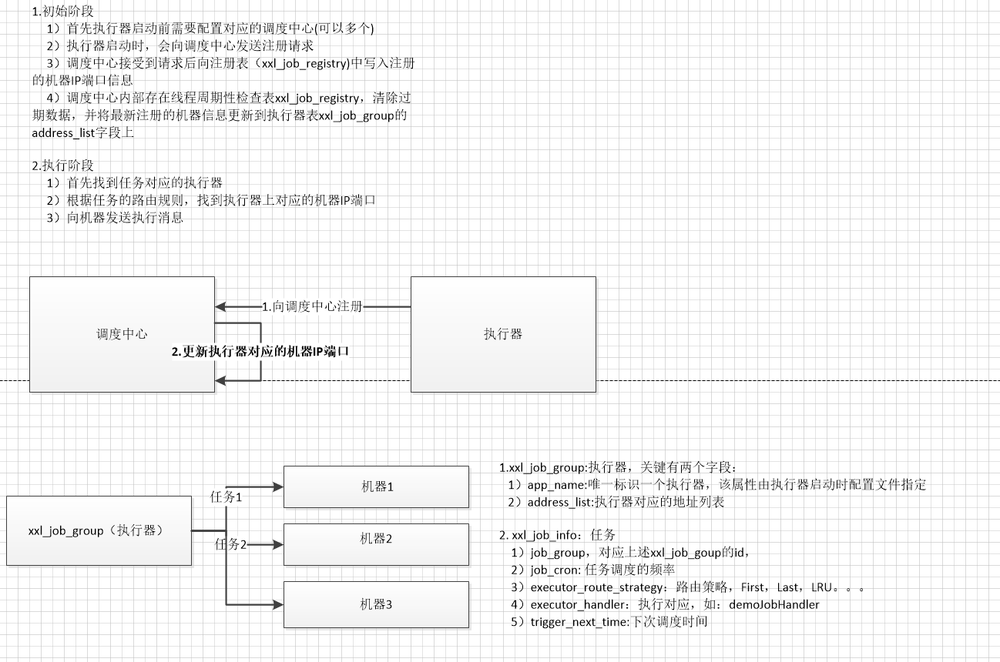

总结：

分布式调度中，
1. 每个执行单元都会向自己的集群机器去注册，所有只要执行单元配置多个调度中心就可以水平扩展了
2. 首先调度中心需要知道所有的可调度的单元的信息，也就是说调度中心某种意义上等同于配置中心
3. 调度时通过RPC通知相应的执行单元即可，关键还是RPC，所以后续会继续研究`dubbo`
4. 这样看来很多东西都是类似的，

    `dubbo`是一个生产者，一个消费者加上一个注册中心，生产者启动时向注册中心注册，消费者向注册中心请求生产者信息并在后续调用时直连生产者

    `xxl`也需要执行器启动时向调度中心注册，并且在调用时选择执行器调用

5. `xxl-job`分片参数，

    如任务1:1-5000 任务2:5001-10000，这些都需要在调度中心配置，对配置人员有一定的门槛，
    
    这样其实和原来单机任务新建多个相同的任务，配置不同的时间段执行相比，只是有些许进步，但不是我理想中的调度。

    所以理想的划分任务应该是自动的，不是由调度中心，不是由某个人员来决定，而是由执行器自动来决定，
    
    如果调度中心来决定，那配置任务的人员就需要知道怎么分配不同的参数给不同的任务

    如果是执行器来决定，每个执行器知道自己的最大能力限制，可以尽最大可能的执行尽量多的任务。相当于抢占式执行。

**重点:个人认为`xxl-job`让调度中心来决定如何分片不是好的方式，理想中的分片应该由执行器决定，即采用抢占式，每个执行器都尽自己最大可能去获取/抢占自己要执行的记录**

