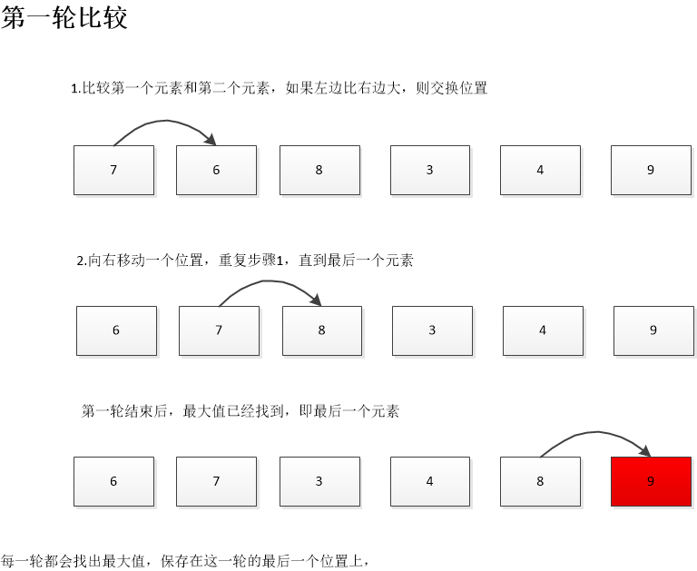
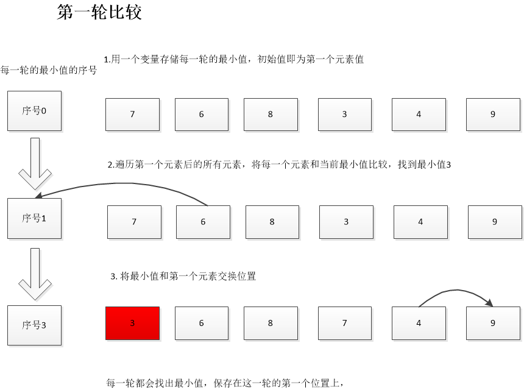
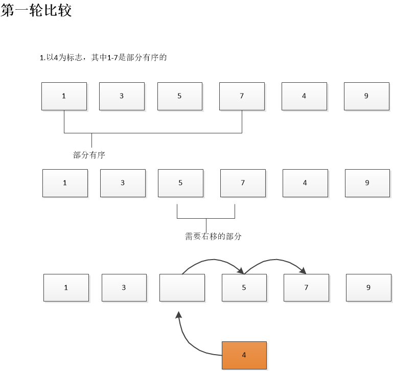

# 一. 冒泡排序

冒泡排序运行起来非常慢，但是是排序算法中最简单的。作为排序入门也是极好的。。。

排序规则如下：

1. 从第一个元素开始，比较相邻两个值
2. 如果左边比右边的大，则交换位置
3. 移动到下一个(第二个)位置，继续比较

下面是示意图：


由上图可知：

第一轮找到最大的值，存储在最后一个位置

第二轮找到第二大的值，存储在倒数第二个位置

代码也就显而易见
```java
   Integer[] value = new Integer[0];

    void bubbleSort() {

        //endIndex:每一轮比较结束的位置
        for (int endIndex = value.length - 1; endIndex > 1; endIndex--) {
            for (int startIndex = 0; startIndex < endIndex; startIndex++) {
                if (value[startIndex] > value[startIndex + 1]) {
                    swap(startIndex,startIndex+1);
                }
            }
        }
    }

    private void swap(int one, int two) {

        int temp = value[one];
        value[one] = value[two];
        value[two] = temp;
    }
```

# 二. 选择排序

冒泡排序无论是比较次数，还是交换次数都是O(N²)，

而选择排序则将交换次数讲到了O(N)

选择排序中不再只比较相邻的两个元素，

选择排序的规则如下：

1. 第一次扫描所有的元素，找出最小的值和最左端的元素交换位置
2. 再次扫描时则从第二个元素开始(第一个元素已经有序)
3. 依次循环

示意图如下:


代码如下:
```java
    void selectSort() {
        //startIndex:每一轮比较的起始位置，最后一个元素不需要
        for (int startIndex = 0; startIndex < value.length - 1; startIndex++) {

            //minIndex：每一轮的最小值，默认为这一轮的起始位置
            int minIndex = startIndex;

            //比较时从该轮的第二个位置比较，因为第一个位置保存到最小值
            for (int i = startIndex + 1; i < value.length; i++) {
                if (value[i] < value[minIndex]) {
                    minIndex = i;
                }
            }

            swap(startIndex, minIndex);
        }
    }
```

# 三. 插入排序

插入排序一般用作较复杂的排序的最后阶段，如快速排序。

**局部有序**

在队列的中间确定一个标志，该标志之前的都是局部有序的，

即在这个标志左边所有的元素都比它左边的元素大，

然而这些元素的最终位置尚未确定，因为还有未排序的元素需要插入到他们中间，他们的位置还要变动。

示意图如下:


代码如下:
```java
 void insertSort() {

        //假设标志是序号1，因为序号0前面没有元素
        for (int startIndex = 1; startIndex < value.length; startIndex++) {

            //保存标志位元素，腾出位置给需要移动的元素
            Integer tmp = value[startIndex];

            int in = startIndex;
            while (in > 0 && value[in - 1] > tmp) {
                value[in] = value[in-1];
                in--;
            }
            value[in] = tmp;

        }
    }
```