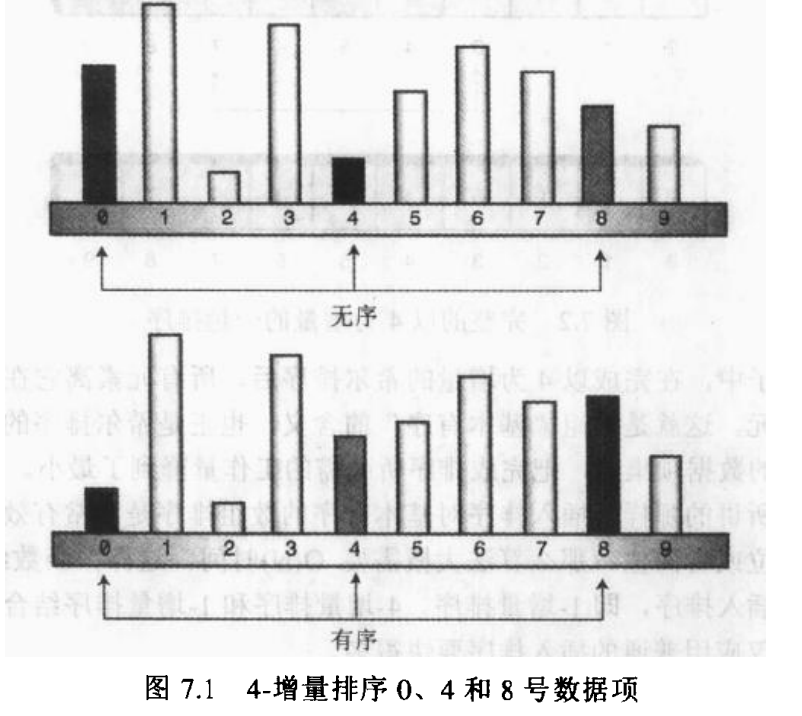

# 一. 归并排序

原本归并排序是在 递归 这一章介绍的，但是讲解快速排序时候使用到了归并，所以调整下，这里先介绍下归并排序。

## 1. 归并算法
归并算法的中心是合并两个已经有序的数组，生成第三个数组。

示意图如下：


代码如下：
```java

    void mergeSort() {
        int[] a = {23, 47, 81, 95};
        int[] b = {7, 14, 39, 55, 62, 74};

        int[] c = new int[a.length + b.length];

        int aIndex = 0;
        int bIndex = 0;
        int cIndex = 0;

        while (aIndex < a.length - 1 && bIndex < b.length - 1) {
            if (a[aIndex] < b[bIndex]) {
                c[cIndex++] = a[aIndex++];
            } else {
                c[cIndex++] = b[bIndex++];
            }
        }

        while (aIndex < a.length - 1) {
            c[cIndex++] = a[aIndex++];
        }

        while (bIndex < b.length - 1) {
            c[cIndex++] = b[bIndex++];
        }

    }
```

## 1. 归并排序


# 二. 希尔排序

希尔排序对于中等大小规模的数组排序表现良好。

虽然它不像快速排序或其他复杂度为O(N*㏒N)的排序算法那么快，但是比选择排序和插入排序这种O(N²)的排序算法还是要快很多

关键希尔算法代码既短又简单，

并且在最坏情况下和平均情况下执行的效率并没有差很多，

而快速排序如果没有采取预防错误，最坏的情况下执行效率会非常差。

所以有专家建议，在排序工作开始时可以采用希尔排序，若在实际中证明它不够快，再采用诸如快排这样更高级的排序算法。

## 1. 插入排序的问题
由于希尔排序是基于插入排序的，所以我们有必要回顾下[插入排序](data_structures_01.md#插入排序)

复制的次数太多，平均需要移动N/2个元素


## 2. n-增量排序

希尔排序通过加大插入排序中元素的间隔，并在这些有间隔的元素中进行插入排序，从而使数据能大幅度的移动。


* 当对0，4，8完成排序后，算法右移一位，对1，5，9排序
* 持续进行，直到所有数据都完成4-增量排序
* 当完成4-增量排序后，可进行普通的插入排序，即1-增量排序

### 2.1 如何减少间隔

上面介绍了以4为初始间隔对包含10个数据项进行排序的情况。

对于不同数量的数据项，间隔应该是动态变化的，开始间隔很多，然后不断缩小，直至为1(即插入排序)。

举例：包含有1000个数据项的数组，可能一开始先以164作为增量，然后121，然后40，然后13，然后4，最后以1为增量进行希尔排序，用来形成间隔的数列称之为`间隔序列`

`间隔序列`由Knuth提出，此数列以逆向的形式从1开始，通过递归表达式`h=3*h+1`,来产生


如何使用间隔序列呢？

一直调用表达式，直到h值大于数组长度为止，则h值作为起始间隔，当然也可以用`h=(h-1)/3`倒推

代码实现,这里详细记录下代码的逐步实现过程

首先大体结构如下：
```java
void shellSort() {
        //1. 获取最初的h值，该值（是在不大于数组长度的前提下的）最大值
        int h = 1;
        while (h <= value.length / 3) {
            h = h * 3 + 1;
        }


        //2.写出整体结构，间隔序列逐渐减少直至为1
        while (h > 0) {
            //TODO 针对 每一轮排序

            h = (h - 1) / 3;
        }
    }
```

第二步，完成每一轮排序(本质上是插入排序):

```java
 void shellSort1() {
        //1. 获取最初的h值，该值（是在不大于数组长度的前提下的）最大值
        int h = 1;
        while (h <= value.length / 3) {
            h = h * 3 + 1;
        }
        int tmp;
        //2.写出整体结构，间隔序列逐渐减少直至为1
        while (h > 0) {

            //i:默认是0直至h，
            // 第一轮比较0，h，2h,3h....
            // 第二轮比较1,1+h,1+2h,2+2h
            for (int i = 0; i < h; i++) {

                for (int j = i + h; j < value.length; j += h) {
                    tmp = value[j];

                    while (j - h >= 0 && value[j - h] > tmp) {
                        value[j] = value[j - h];
                        j -= h;
                    }

                    value[j] = tmp;
                }
            }

            h = (h - 1) / 3;
        }
    }
```

样本案例如下：
```java
 void shellSort() {
        //1. 获取最初的h值，该值（是在不大于数组长度的前提下的）最大值
        int h = 1;
        while (h <= value.length / 3) {
            h = h * 3 + 1;
        }

        int inner;
        int outter;
        int tmp;

        //2.写出整体结构，间隔序列逐渐减少直至为1
        while (h > 0) {
            //TODO 此处比较疑惑
            for (outter = h; outter < value.length; outter++) {
                tmp = value[outter];
                inner = outter;

                while (inner > h - 1 && value[inner - h] >= tmp) {
                    value[inner] = value[inner - h];
                    inner -= h;
                }
                value[inner] = tmp;
            }

            h = (h - 1) / 3;
        }
    }
```

总结下：

希尔排序本质上是高级版本的插入排序，通过调整间隔序列的大小来达到优化。

# 三. 划分

**划分是快排的基础**

> 划分就是选定一个值，使得所有小于该值的元素在一组，大于该值的元素在另一组。

如下图所示:


上图水平线代表选定的基准值，在快排中是选定一个**具体的数据项的值**作为基准值，称之为**枢纽**。

划分完成后比以前有序了，但不是完全有序，下面发现要使他完全有序并不是很难。

```java
    int partitionIt(int left, int right, int pivot) {
        int leftPtr = left - 1;
        int rightPtr = right + 1;

        while (true) {
            //leftPtr定位到一个大于pivot的值为止
            while (leftPtr < right && value[++leftPtr] < pivot)
                ;
            //leftPtr定位到一个大于pivot的值为止
            while (right > left && value[--rightPtr] > pivot)
                ;
            if (leftPtr >= rightPtr) {
                break;
            } else {
                swap(leftPtr, rightPtr);
            }

        }
        return leftPtr;
    }

    int pivot =99;
    int partDex = partitionIt(0,value.size()-1,pivot);
```

## 3.1 划分算法分析
 划分算法由两个指针`leftPtr`,`rightPtr`完成主要工作，

 `leftPtr`向右移动，`rightPtr`向左移动

 实际上，`leftPtr`初始化时指向第一个数据项的左边一位，`rightPtr`指向最后一个数据项的右边一位，因为他们在工作之前，都要分别+1和-1。

 当`leftPtr`遇到比枢纽小的数据项时，继续右移，因为比枢纽小的数据已处于正确的位置，直到遇到比枢纽大的数据项时，才停止。

 同理，`rightPtr`遇到比枢纽大的数据项时，继续左移，因为比枢纽大的数据已处于正确的位置，直到遇到比枢纽小的数据项时才停止。

第一个`while`应用于`leftPtr`,第二个`while`应用于`rightPtr`，当两个`while`循环都跳出时，`leftPtr`和`rightPtr`都指向数组错误的位置(一个偏大，一个偏小)，所以正好交换，达到平衡。

交换后，继续移动两个指针。

## 3.2 优化处理-处理异常

如果所有数据都小于枢纽，`leftPtr`将会遍历整个数组。然后越界。`rightPtr`同理

所以我们的样例代码中加入了`leftPtr<right`和`rightPtr>left`的边界检测代码。

在后面的快排中，我们可以看到更为巧妙的枢纽选择，可以去掉这些边界检测。使得运行速度更快。

```java
while(leftPtr<right && value[++leftPtr]<pivot>)
;
```
可以改为
```java
while(leftPtr<right && value[leftPtr]<pivot>)
    leftPtr++;
```

这个变动使得初始值设为`left`和`right`比原有代码更为易懂。
但这个变动导致满足条件时指针才会移动，指针在任何情况下都应该移动，所以还是保持原状即执行空指令。

## 3.2 优化处理-相同关键字

仔细观察之前的代码，(和枢纽)相同的关键字也会被交换。

看起来这样是浪费时间的，但是如果相同的关键字不交换的话`leftPtr`和`rightPtr`停在了数组的两端，停在两端是糟糕的。

# 四. 快速排序

快速排序是最流行的排序算法，大都数情况下，快排是最快的。(**注意:仅仅是针对内部排序或者说是基于随机存储器内的排序，因为磁盘中的数据排序，其他排序算法更好。**)

快速排序是在 1962 年由 C.A.R.Hoare发现的。

快速排序本质上通过把一个数组划分成两个子数组，然后递归地调用自身为每个子数组进行快速排序来实现的。

首先给出代码实现：
```java
void recQuickSort(int left, int right) {
    if (right - left <= 0) {
        return;
    } else {
        int patition = partitionIt(left, right);

        recQuickSort(left, patition - 1);
        recQuickSort(patition + 1, right);
    }
}
```

调用`partitionIt`对数组进行划分，方法返回分割边界的下标值，即右边子数组的最左端的数据项。
如下图：


注意：划分后，对左边的数组调用是从`left`至`paritition-1`,右边的数组调用是从`paritition+1`至`right`
两者都跳过了`paritition`指向的元素，为什么？关键是枢纽的选择。

## 4.1 选择枢纽
选择枢纽的几个指导思想：
1. 应该选择具体的一个数据项的关键字的值作为枢纽，称之为`pivot`.
2. 可以选择任意一个数据项作为枢纽，为了简便，我们假设总是选择待划分的子数组的最后端的数据项作为枢纽
3. 划分完成之后，如果枢纽被插入到了左右子数组之间的分解处，那么枢纽就落在排序之后的最终位置

第三个听起来是不可能的，**但请记住，正式因为使用枢纽的关键字的值来划分数组，所以划分之后的左边的数组包含的所有数据项都小于枢纽，后边子数字的所有数据项都大于枢纽，但是如果以某种方式把它放在两个子数组之间，枢纽就会在正确的位置上了，即在它的最终排序的位置上了。**
如下图：


上图只是示意，具体操作 可以将右边子数组所有数据项右移一位，但是这样既低效又没有必要。

只需要记住右边的子数组所有数据项都大于枢纽，但尚未排好序。所以可以在右边子数组内部移动而没有其他影响。

因此只需要交换 **枢纽** 和 **右边数组最左端** 的数据项就可以了。


为了将选择枢纽的过程合并到`recQuickSort`方法中，用一个明显的语句为枢纽赋值，并且把枢纽的值作为参数传递给`partitionIt()`,完整代码如下:
```java

public void quickSort()
{
    recQuickSort(0,valuen.length-1);
}
void recQuickSort(int left, int right) {
    if (right - left <= 0) {
        return;
    } else {
        int pivot = value[right];
        int patition = partitionIt1(left, right, pivot);

        recQuickSort(left, patition - 1);
        recQuickSort(patition + 1, right);
    }
}

int partitionIt1(int left, int right, int pivot) {
    int leftPtr = left - 1;
    int rightPtr = right;//因为选择了最右端元素作为pivot，所以排除最后一个元素

    while (true) {
        while (value[++leftPtr] < pivot)//因为选择了最后端数据项作为枢纽，所以leftPtr总会停在枢纽位置上，由此可以发现选择最后端代码的好处之一是消除了不必要的边界检测
            ;
        while (rightPtr > 0 && value[--rightPtr] > pivot)
            ;
        if (leftPtr >= rightPtr) {
            break;
        } else {
            swap(leftPtr, rightPtr);
        }
    }
    swap(leftPtr, right);//为什么选择leftPtr,因为leftPtr已经指向右边数组的最左端元素
    return leftPtr;
}

```

### 4.2 三数据项取中法

当数据项是无序排列时，选择最右端不会太坏，但是当数组是逆序排列时，选择最右端就不是一个好的选择。


折中的办法是从数组第一个，中间和最后一个找一个居中的数据项值，并且设置次数为枢纽。

三数据项取中除了选择枢纽更为有效之外，还有一个额外的好处：可以在第二个内部`while`中取消边界的检测，这是怎那么实现的？
> 因为在三数据项取中的过程中，不但选择了枢纽，还对3个数据项进行了排序，所以可以消除这个边界检测
示意图如下：


而且排序过程中就不需要再考虑这3个数据项了，划分可以从left+1和right-1开始了

总结下，三数据项取中的作用有3点：
1. 找到快排需要的枢纽
2. 减少冗余的边界检测
3. 减少需要排序的数据项

改造后的代码实现如下：
```java
void recQuickSort2(int left, int right) {
    int pivot = medianOf3(left, right);
    int patition = partitionIt2(left, right, pivot);

    recQuickSort(left, patition - 1);
    recQuickSort(patition + 1, right);
}


private int medianOf3(int left, int right) {
    int center = (right + left) / 2;
    if (value[left] > value[center]) {
        swap(left, center);
    }
    if (value[left] > value[right]) {
        swap(left, right);
    }
    if (value[center] > value[right]) {
        swap(center, right);
    }
    swap(center, right - 1);//将枢纽放到最后端
    return value[right - 1];//返回枢纽
}

int partitionIt2(int left, int right, int pivot) {
    int leftPtr = left;
    int rightPtr = right - 1;//因为选择了最右端元素作为pivot，所以排除最后一个元素

    while (true) {
        while (value[++leftPtr] < pivot)//①
            ;
        while (value[--rightPtr] > pivot)
            ;
        if (leftPtr >= rightPtr) {
            break;
        } else {
            swap(leftPtr, rightPtr);
        }
    }
    swap(leftPtr, right - 1);
    return rightPtr;
}
```
# 五. 基数排序

TODO


