# 为什么使用二叉树

因为它结合了有序数组和链表的优点：查询和有序数组一样快，插入/删除和链表一样快。

树本质上是图的特例。

# 二叉树


先通过下图了解下树的结构及常用术语：

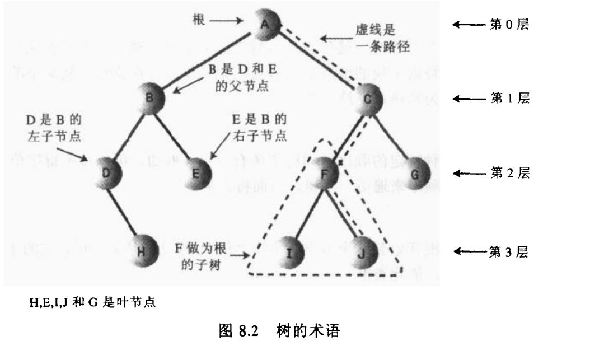

二叉树：如果树中每个节点最多只能有两个子节点，这样的树就称之为**二叉树**，且其左节点的值小于该节点，右节点的值大于该节点。

如果树中的大部分的节点都在根的一边，我们称这样的树为**不平衡树**
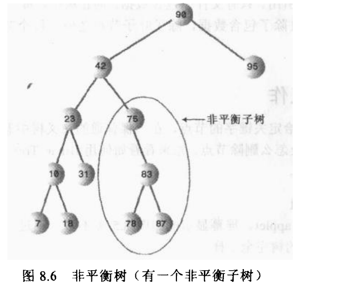

之所有造成不平衡的情况，是因为大部分(所有)的节点都大于或小于根节点。

我们后续在一章探讨解决树不平衡的问题。

# 树操作

直接看实现吧
```java
public class Tree {

    public static class Node {
        int value;
        Node left;
        Node right;
    }

    private Node root;

    public Node find(int value) {
        Node current = root;

        while (current.value != value) {
            if (current.value < value) {
                current = current.right;
            } else {
                current = current.left;
            }

            if (current == null) {
                return null;
            }
        }
        return current;
    }

    public void insert(int value) {
        Node newNode = new Node();
        newNode.value = value;

        if (root == null) {
            root = newNode;
        } else {
            Node current = root;
            Node parent;

            while (true) {
                parent = current;

                if (value < current.value) {
                    current = current.left;
                    if (current == null) {
                        parent.left = newNode;
                        return;
                    }
                } else {
                    current = current.right;
                    if (current == null) {
                        parent.right = newNode;
                        return;
                    }
                }
            }

        }
    }

    public void walk() {
        preorder(root);
        inorder(root);
        postorder(root);
    }


    //前序遍历
    public void preorder(Node node) {
        if (node == null)
            return;

        System.out.println("node--->" + node.value);
        preorder(node.left);
        preorder(node.right);
    }

    //中序遍历
    public void inorder(Node node) {
        if (node == null)
            return;

        preorder(node.left);
        System.out.println("node--->" + node.value);
        preorder(node.right);
    }

    //后序遍历
    public void postorder(Node node) {
        if (node == null)
            return;

        preorder(node.left);
        preorder(node.right);
        System.out.println("node--->" + node.value);
    }

    public Node findMax() {
        Node currnet = root;
        Node parent = currnet;

        while (currnet != null) {
            parent = currnet;
            currnet = currnet.right;
        }
        return parent;
    }

    public Node findMin() {
        Node currnet = root;
        Node parent = currnet;

        while (currnet != null) {
            parent = currnet;
            currnet = currnet.left;
        }
        return currnet;
    }
}

```

# 删除

删除操作是二叉树中最复杂的操作。

主要流程和之前的`find`和`insert`操作是一样的：即找到要删除的节点

找到之后有三种情况：
1. 该节点是叶子节点
2. 该节点有一个子节点
3. 该节点有两个字节点


## 1.该节点是叶子节点

示意图如下:
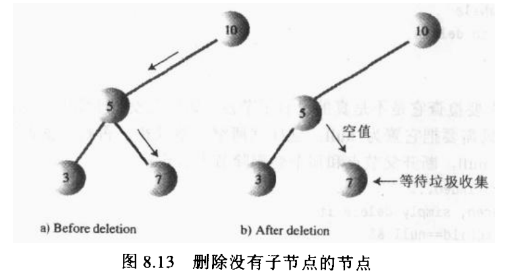

```java
 public boolean delete(int value) {
        //1.找到要删除的节点，要操作 删除节点的 父节点，将父节点的left/right置为null
        Node current = root;
        //要删除的节点是否父节点的左节点
        boolean isLeft = true;
        Node parent = current;

        while (current.value != value) {
            parent = current;
            if (value < current.value) {
                current = current.left;
                isLeft = true;
            } else if (value > current.value) {
                current = current.right;
                isLeft = false;
            }
            if (current == null) {
                return false;//未找到
            }
        }
        //2. 删除
        if (current.left == null && current.right == null) {

            if (root == current) {
                root = null;
            }
            if (isLeft) {
                parent.left = null;
            } else {
                parent.right = null;
            }
            current = null;

            return true;
        }
        else
 {

 }

        return true;
    }
```
## 2.该节点有一个子节点

这种情况也不复杂，我们称要删除的节点为`deleteNode`


只需要把`deleteNode`的父节点的`left`/`right`指向`deleteNode`的唯一子节点
示意图如下:
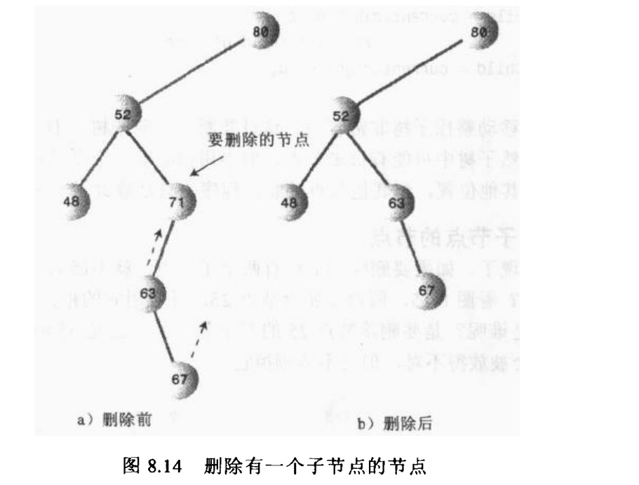

```java
 if (current.left == null) {
    //2.2 有一个right子节点
    if (root == current) {
        root = current.right;
    } else {
        if (isLeft) {
            parent.left = current.right;
        } else {
            parent.right = current.right;
        }
    }

} else if (current.right == null) {
    //2.2 有一个left子节点
    if (root == current) {
        root = current.left;
    } else {
        if (isLeft) {
            parent.left = current.left;
        } else {
            parent.right = current.left;
        }
    }
```

## 3.该节点有两个子节点

下图 是一个错误的代替方法：用右子树替代删除节点的示意图：
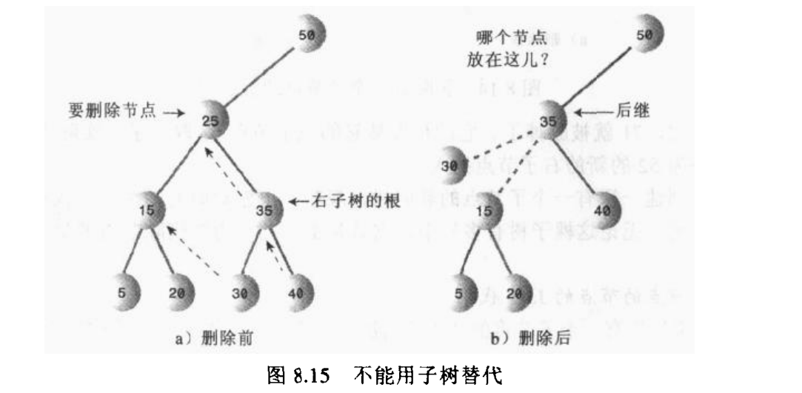

关键点在于：

**对每一个节点来说，比该节点的值 次高 的是它的中序后继节点**

所以有两个节点的处理方式也就显而易见了：用它的中序后继节点代替之。
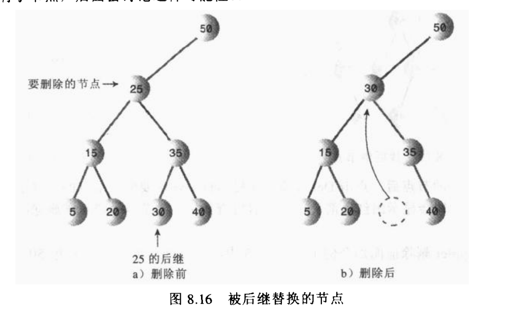


如何定位中序后继节点呢？

首先找到`deleteNode`的右节点，因为右节点树中所有的节点都大于`deleteNode`，所以只需要找到 **右节点树** 中的最小值即可

如果右节点没有子左节点，则右节点本身就是后继节点；否则递归找到右节点的子左节点

示意图如下：
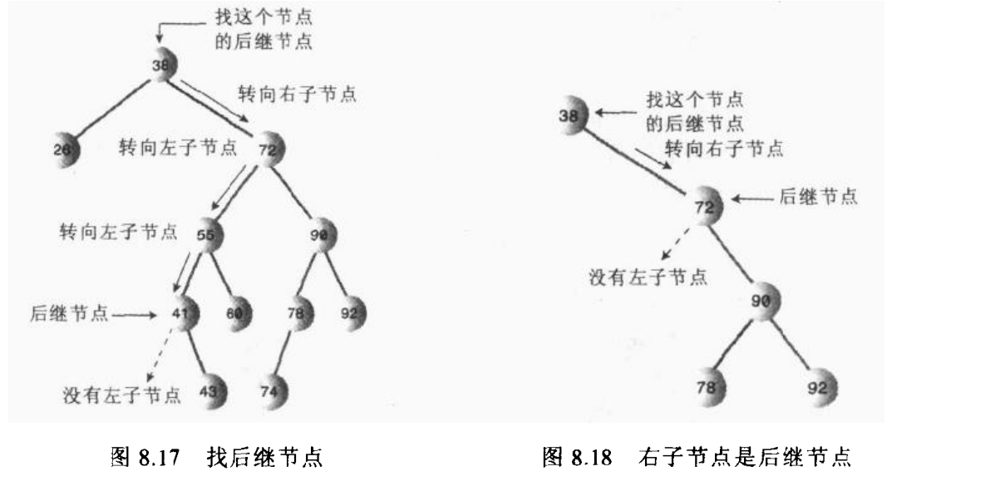


**TODO:**

比较取巧的办法是在`Node`中添加一个`isDelete`属性，删除时候直接将该属性置为`true`

## 用数组表示树
还有一种完全不同的方法表示树：数组

用数组的方法表示树，节点保存在数组中，节点间不是通过引用相连。

其中下标为0的是根，下标为1的是根的左子节点，一次类推
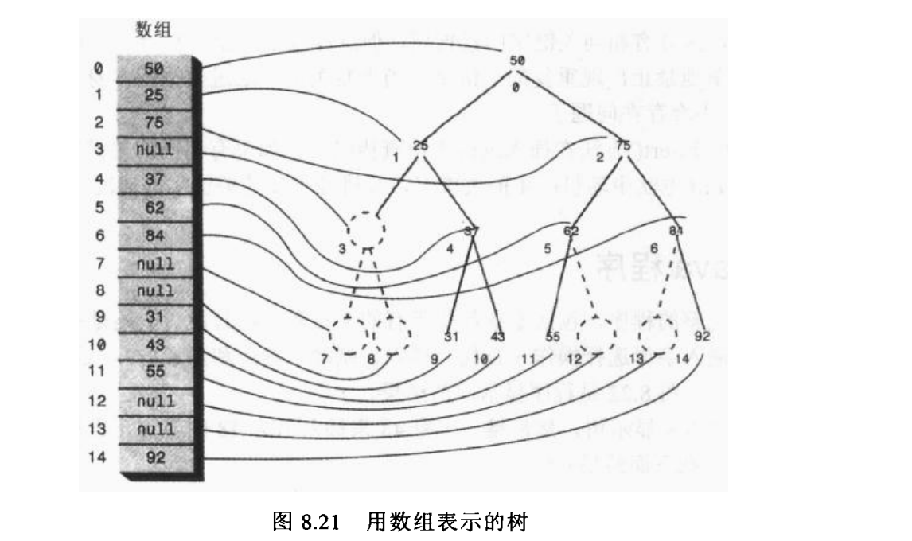


设置节点索引值为`index`,则左子节点是`2*index+1`,右子节点是`2*index+2`，父节点是`(index-1)/2`

大都数情况下，数组表示树不是很有效率，不满的节点和删除的节点都在数组中留下了洞，浪费了存储空间。更坏的是删除节点时需要移动子树的化，子树每个节点都要移到数组中新的位置，很费时。

## 重复值

目前 插入时候都是插入到值相同的右子节点。

取巧的做法是禁止出现重复关键字


# Huffman编码

哈夫曼编码是采用二叉树的方式来压缩数据的。右`David Huffman`在1952年发现该方法。

## 字符编码

首先了解下，在计算机世界里每个字符都是由一个(如`ASCII`编码)或多个(如`Unicode`编码)表示。

下图列出来一些常用字符的`ASCII`编码，可以看到都是由8个位表示。
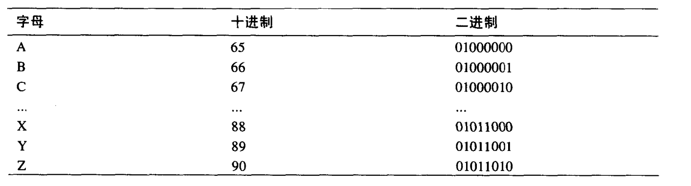

由此可以想到压缩的最常用的方法就是：减少常用字符的位数量

假设只用两位表示`E`,如`01`,那么就不能给其他字母都用两位编码了，
原因在于：
如果用起始位组合相同的代码表示不同的字符，那么解码时就搞不清楚`01011000`前面的`01`是表示字符`E`还是表示`X`的开始部分了。

因此产生了编码的一个重要规则：

**每个字符的编码不能是其他字符编码的前缀**


还有一些时候`E`并不是最常用的字符，如编写java程序时`;`可能都比`E`出现的次数多。

假设要发送消息：`SUSIE SAYS IT IS EASY`.字母`S`出现的最多，其次是空格

用下列表格列出每种字符出现的次数，这样的表称为`频率表`
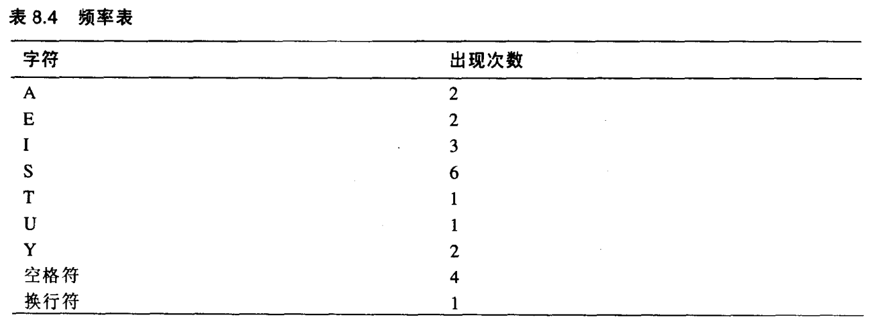

遵循 `次数最多的字符所占位数应该最少` 的原则，下图显示了是如何编码的
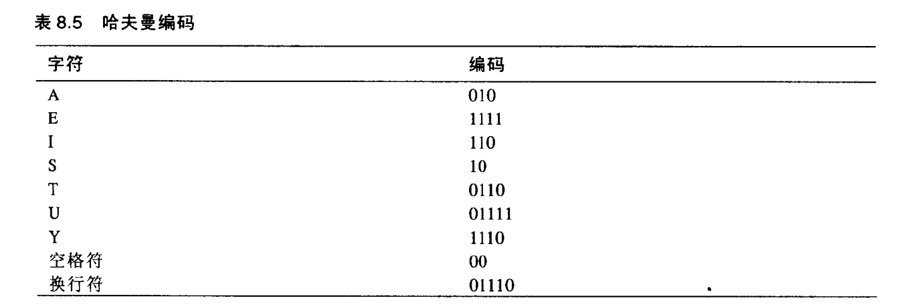
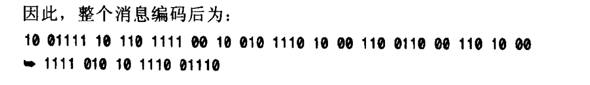

## 用哈夫曼树解码
怎样才能将上述字节转换成字符呢，此处就采用叫做哈夫曼树的二叉树来解决解码问题。
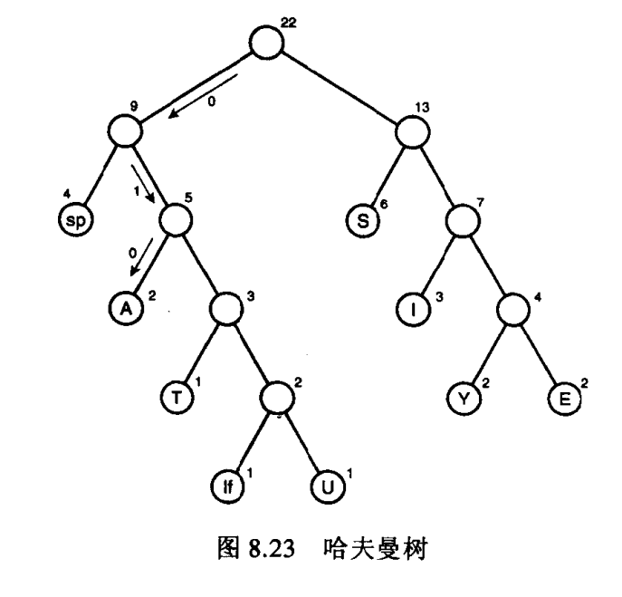

1. 每个叶子节点代表一个字符
2. 圈外的数字代表出现的频率
3. 非叶子节点的数字就是子节点的频率的和
4. 频率越大在树中的位置就越高


如何使用这棵树呢？

每个字符的编码如果是`0101`,逐位解析，如果遇到`0`，就向左走到下个节点；如果遇到`1`，就向右。

## 创建哈夫曼树

下面是建立哈夫曼树的算法：
1. 为每个字符创建`Node`对象，节点有两个属性：字符和出现的频率。
2. 创建`tree`对象
3. 把这些节点插入到一个优先级队列中，按频率排序，频率最小的节点有最高的优先级

然后
1. 从优先级队列中删除两个节点，并把他们作为一个新节点的子节点，新节点的频率是子节点频率的和(字符可以是空)
2. 把新的三节点树插回到优先级队列里。
3. 重复步骤1，3，当队列中只有一棵树时，它就是所建的哈夫曼树

示意图如下
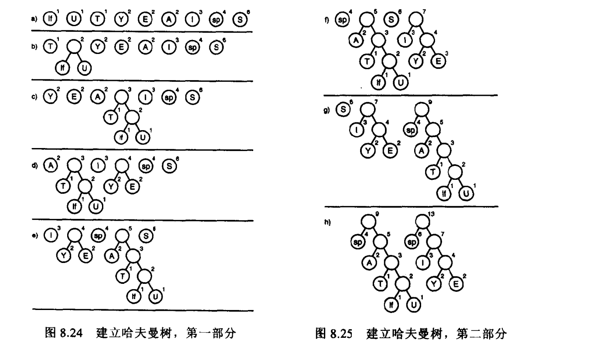

## 信息编码
信息编码从建立代码表开始，这个表理出了每个字符的哈夫曼代码。
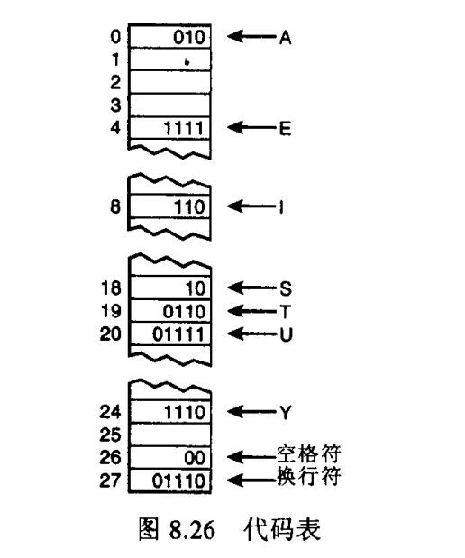

## 创建哈夫曼编码
怎样建立哈夫曼编码，生成代码表呢？

类似于信息解码的过程。
从根开始顺着一条可能的路径到达叶子节点，记录向左和向右的顺序，0代表左，1代表右。

# 总结
哈夫曼树的关键点在于：1. 优先级队列 2. 频率表