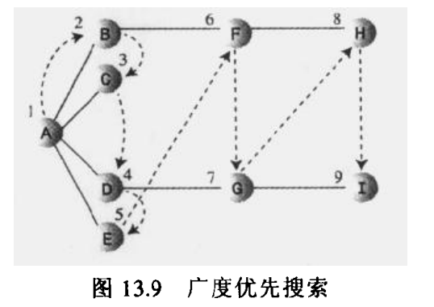

# 一. 图的基本概念

* 邻接：两个顶点被同一条边连接，就称这两个顶点是邻接的
* 路径：路径是边的序列。
* 连通：至少右一条路径可以连接所有的顶点，那么这个图被称作连通的。

有向图和带权图：

* 无向图：图中的边没有方向，可以从任意以便到另外一边。所以可以从`A`到`B`,也可以从`B`到`A`,两者是等价的。（无向图很好的模拟了高速公路网，因为公路可以按照两个方向行驶）

* 有向图：在某些图中，边被赋予一个权值，能代表两个顶点间的物理举例或者时间或者花费，这样的图叫做带权图。（如飞机航线）

本节我们主要讨论无向、无权图。

# 二. 如何在程序中表示图


顶点比较好实现
```java
public class Vertex {
    private int label;
    private  boolean isVisited;
}
```
边比较麻烦一点，考虑到图并不像树，拥有固定的结构，
为了模拟图这种自由形式的组织结构，需要用一种不同的方法表示边

主要有以下两种方式：
1. 邻接矩阵
2. 邻接表

## 2.1 邻接矩阵
邻接矩阵是一个二维数组，数据项表示两点间是否存在边。

如果有N个顶点，则邻接矩阵就是N*N的数组

示意图：<br>


观察上图，可以得出以下几点
* 两个顶点有边则标识为1，否则为0
* 顶点与自身连接表示为0
* 矩阵的上三角是下三角的镜像

上三角和下三角互为镜像，冗余低效，但在计算机中，创造一个三角形数组比较困难，只能接受这个冗余

## 2.2 邻接表

邻接表本质上是一个链表数组(或链表的链表)。

每个单独的链表表示了有哪些顶点和当前顶点邻接。

示意图如下：<br>


`->`表示链表中的一个节点，并不强求有序，与路径无关。


## 2.3 在图中添加顶点和边

首先我们用`vertexList`表示顶点数组，
1. 创建一个顶点
```java
vertexList[i++] = new  Vertex('A');
```

1. 添加边

添加边取决于是采用邻接矩阵还是邻接表表示。

如果使用邻接矩阵在顶点1和顶点3加一条边时，
```java
adjMat[1][3] = 1;
adjMat[3][1] = 1;
```
如果使用邻接表，则把1加入到3的链表中，然后把3加入到1的链表中。

完整实现：
```java

class Vertex {
    private int label;
    private boolean isVisited;

    public Vertex(char label) {
        this.label = label;
        this.isVisited = false;
    }
}

public class Graph {
    private  final  int maxNodes = 20;
    private  Vertex vertexList[];//顶点
    private  int adjMat[][];//邻接矩阵
    private  int nVerts;//当前顶点数目

    public Graph()
    {
        //初始化顶点数组
        vertexList = new Vertex[maxNodes];
        //初始化邻接矩阵
        adjMat = new int[maxNodes][maxNodes];
        for (int i = 0; i < maxNodes; i++) {
            for (int j = 0; j < maxNodes; j++) {
                adjMat[i][j] = 0;
            }
        }
    }

    /**
     * 添加顶点
     * @param label
     */
    public void addVertex(char label)
    {
        vertexList[nVerts++] = new Vertex(label);
    }

    /**
     * 添加边
     * @param start
     * @param end
     */
    public void addEdge(int start,int end)
    {
       adjMat[start][end] =1;
       adjMat[end][start] =1;
    }
}

```

# 三. 搜索
有两种常用的方法用来搜索图：

1. **深度优先搜索**(DFS): 通过栈来实现
2. **广度优先搜索**(BFS): 通过队列来实现

## 3.1 深度优先搜索
整体思想如下图：
<br>


主要有如下几个规则：

1. **如果可能，访问一个邻接的未访问顶点，标记它，并把它放入到栈中。**
2. **当不能执行规则1时，如果栈不为空，就从栈中弹出一个顶点。**
3. **如果不能执行规则1和规则2，就完成了整个搜索过程。**

结合上面3条规则，我们再次梳理下上图的搜索过程：
1. 首先访问起始顶点`A`,并放入到栈中，以便记住他，最后标记该点，这样就不会访问它
2. 访问`A`的未访问过的邻接顶点`B`,并放入栈中
3. 对`B`做相同的事情：找下一个未访问的顶点，即`F`；再次访问`H`
4. `H`没有邻接的顶点，此时执行规则2，弹出顶点`H`,此时又回到了顶点`F`,`F`也没有相邻的顶点，继续弹出`F`
5. 当弹出到`A`时。A还有未访问的临界点，此时访问下一个顶点`C`,接着访问`D`,`G`,`I`,最后访问`A`

下图是搜索过程中栈的内容：


实现代码：
```java

class Vertex {
    private int label;
    private boolean isVisited;

    public Vertex(char label) {
        this.label = label;
        this.isVisited = false;
    }

    public int getLabel() {
        return label;
    }

    public void setLabel(int label) {
        this.label = label;
    }

    public boolean isVisited() {
        return isVisited;
    }

    public void setVisited(boolean visited) {
        isVisited = visited;
    }
}

public class Graph {
    private final int maxNodes = 20;
    private Vertex vertexList[];//顶点
    private int adjMat[][];//邻接矩阵
    private int nVerts;//当前顶点数目

    public Graph() {
        //初始化顶点数组
        vertexList = new Vertex[maxNodes];
        //初始化邻接矩阵
        adjMat = new int[maxNodes][maxNodes];
        for (int i = 0; i < maxNodes; i++) {
            for (int j = 0; j < maxNodes; j++) {
                adjMat[i][j] = 0;
            }
        }
    }

    /**
     * 添加顶点
     *
     * @param label
     */
    public void addVertex(char label) {
        vertexList[nVerts++] = new Vertex(label);
    }

    /**
     * 添加边
     *
     * @param start
     * @param end
     */
    public void addEdge(int start, int end) {
        adjMat[start][end] = 1;
        adjMat[end][start] = 1;
    }


    /**
     * 查找某个未访问过的顶点
     *
     * @param vertIndex 顶点序号
     * @return
     */
    public int getUnVisited(int vertIndex) {
        for (int i = 0; i < nVerts; i++) {
            if (adjMat[vertIndex][i] == 1 && vertexList[i].isVisited() == false) {
                return i;
            }
        }

        return -1;
    }


    private Stack<Integer> stack = new Stack<>();

    /**
     * 深度遍历
     */
    public void dfs() {
        vertexList[0].setVisited(true);
        stack.push(0);

        while (!stack.isEmpty()) {
            //查看栈顶元素有没有未访问的邻接点
            int nextIndex = getUnVisited(stack.peek());
            if (nextIndex > 0) {
                //有则加入栈
                vertexList[nextIndex].setVisited(true);
                System.out.println(vertexList[nextIndex].getLabel());
                stack.push(nextIndex);
            } else {
                //无则弹出
                stack.pop();
            }
        }
    }
}
```
## 3.2 广度优先搜索
整体思想如下图：
<br>


主要有如下几个规则：

1. **访问下一个未访问的邻接点(如果存在),这个顶点必须是当前顶点的邻接点，标记它，并把它插入到队列中。**
2. **如果因为已经没有未访问顶点而不能执行规则1，那么从队列头取一个顶点，使其成为当前顶点。**
3. **如果因为队列为空而不能执行规则2，就完成了整个搜索过程。**

结合上面3条规则，我们再次梳理下上图的搜索过程：
1. 首先访问起始顶点`A`，加入队列
2. 从队列中弹出元素，作为当前顶点，然后访问当前顶点所有未访问过的邻接顶点`B`，`C`,`D`,`E`,这时队列包含`BCDE`
3. 重复执行步骤2
4. 最后队列中还剩下`HI`时，但当取出他们时，没有发现其他的未访问顶点，此时队列为空。搜索结束。

下图是搜索过程中栈的内容：

```java
   private Queue<Integer> queue = new LinkedList<>();

    /**
     * 广度遍历
     */
    public void bfs() {
        vertexList[0].setVisited(true);
        System.out.println(vertexList[0].getLabel());

        while (!stack.isEmpty()) {

            Integer currnetElement = queue.remove();
            int nextIndex = -1;

            //加入所有的邻接点
            while ((nextIndex = getUnVisited(currnetElement)) > -1) {
                vertexList[nextIndex].setVisited(true);
                System.out.println(vertexList[nextIndex].getLabel());
                queue.add(nextIndex);
            }
        }
    }
```

广度遍历有一个有趣的属性：它首先找到与起始顶点相距一条边的所有顶点，然后是与起始点相距两条边的顶点，依次类推。

如果要寻找起始顶点到指定顶点的最短举例，那么执行BFS，当找到指定的顶点时，就可以说这条路径是到这个顶点的最短路径。

# 四. 最小生成树

用最少的边连接所有的顶点，这样就组成了**最小生成树**。

下图右侧即为最小生成树：


1. 对于给定的一组顶点，可能有多种最小生成树。
2. 最小生成树边`E`的数量总是比顶点`V`的数量小1
> E = V-1
3. 不关心边的长度，只是要找最少数量的边，而不是最短路径

创建最小生成树的算法和搜索算法几乎相同，本例使用深度优先搜索。

下面可以看到最小生成树算法(mst)和前面看到的深度优先搜索算法之间的唯一区别就是mst必须记录走过的边。
```java
public void mst() {
    while (!stack.isEmpty()) {
        //查看栈顶元素有没有未访问的邻接点
        int currentIndex = stack.peek();
        int nextIndex = getUnVisited(currentIndex);
        if (nextIndex > 0) {
            //有则加入栈
            vertexList[nextIndex].setVisited(true);
            System.out.println(vertexList[nextIndex].getLabel());
            stack.push(nextIndex);

            System.out.println(currentIndex);
            System.out.println(nextIndex);
        } else {
            //无则弹出
            stack.pop();
        }
    }
}
```
# 五. 有向图的拓扑排序

拓扑排序是可以用图模拟的另外一种操作。可用于表示某些事件必须按照特定的顺序排列或发生。

## 5.1 有向图
图只需要在已有的基础上添加方向即可。对应到邻接矩阵，则只有一项


## 5.2 拓扑排序算法
下面以课程为例，描述了得到数学学位所需要修的课程：


下面按课程的先后关系排列他们，下面是得到的序列：
> BAEDGCFH

拓扑排序算法的思想虽然不寻常但是很简单。

1. 找到一个没有后继的顶点
> 顶点的后继即该节点有一条边指向该节点。A指向B，则B是A的后续。图中唯一没有后继的顶点是H

2. 从图中删除这个顶点，在列表的前面插入顶点的标记

重复步骤1和2，直到所有的顶点都从图中删除，这时顶点的顺序就是拓扑排序的结果。

## 5.3 环和树

有环图是拓扑排序算法不能处理的。
有环图：路径的起点和重点都是同一个顶点，则形成了有环图。

不包含环的图叫做树。二叉树和多叉树就是这个意义上的树。

但是在图中出现的树比一般树更具有一般意义，因为它没有子节点的最大个数限制。

要计算出无向图是否存在环也很简单：如果有N个顶点的图有超过N-1条边，那么它必定存在环，

**拓扑排序必须在无环的有向图中进行，这样的图叫做有向无环图（DAG）**


